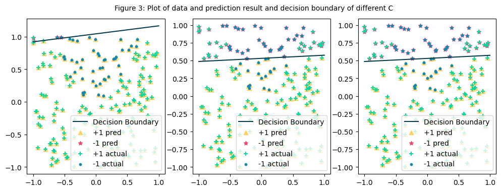

# Solution of Week 2

> Data Id: 18-36--18

## a

### a.i

Figure 1 shows the data, where X_1 and X_2 are the different features. It can be seen that the data are split into two different target values, the blue dot marker is -1, and the green plus marker is +1.    

> 
>
> <p align="center">Figure 1: Scatter plot of data</p>

### a.ii

Use the `train_test_split` function in python's `sklearn` library to randomly distribute the data set according to the ratio of the test set to the train set of 2:8. Then substitute the data into the `LogisticRegression` function to solve the result of the linear model $y = θ_0 + θ_1*X_1 + θ_2*X_2$. 

The parameter values of the trained model are $θ_0 = 2.187, θ_1 = 0.149$ and $ θ_2 = -4.027$. Thus, the linear model is $y = 2.187 + 0.149 * x_1 - 4.027 * x_2$. It is apparent from the model that $x_2$ has the most influence on the prediction than $x_1$. But $x_1$ causes the prediction to increase and since the coefficient of  $x_2$ is negative, it causes the prediction to decrease. 

### a.iii

Due to the data set being divided into a train set and a test set earlier when making predictions in this part, the test set is used. The predicted result can be obtained by substituting the test set data into the `predict` function. The predicted results are shown in Figure 2 based on Figure 1. (To distinguish it from the previous data set, the prediction results are marked with different colours and markers here)

> 
>
> <p align="center">Figure 2: Plot of data and prediction result and decision boundary</p>

The linear model is $y = 2.187 + 0.149 * x_1 - 4.027 * x_2$. When $y > 0$, the target value is +1, and when $y < 0$, the target value is -1. So, when $y = 0$, that is, $2.187 + 0.149 * x_1 - 4.027 * x_2 = 0$, it is the decision boundary. The line of the decision boundary is marked in Figure 2 using black colour.

### a.iv

By substituting the test set data's target value and the prediction results into the `accuracy_score` function, accuracy can be obtained. The test data set's accuracy score is 0.79.

```python
from sklearn.metrics import accuracy_score

score = accuracy_score(y_pred, y_test)
print(score)
# score: 0.79
```

As can be seen from Figure 2, above the decision boundary, some red stars appear in the area of the green plus sign. Below the decision boundary, some yellow triangles appear in the blue dot area. These data are misclassified data.

## b

### b.i

By introducing the `LinearSVC` function and filling in a different penalty (C), the train data can be fitted into a model.

- C = 0.001
  - $y = 0.322 + 0.038 * x_1 - 0.309 * x_2$
  - From the model, we can see clearly that the coefficient(-0.309) weight of $x_2$ is higher than that of $x_1$(0.038), that is, the influence of $x_2$ is greater than that of $x_1$. But since the coefficient(-0.309) of $x_2$ is negative, $x_2$ plays a negative role in the prediction of the model, while $x_1$ is positive.
- C = 1.00
  - $y = 0.722 + 0.060 * x_1 - 1.358 * x_2$
  - From the model, we can see clearly that the coefficient(-1.358) weight of $x_2$ is higher than that of $x_1$(0.060), that is, the influence of $x_2$ is greater than that of $x_1$. But since the coefficient(-1.358) of $x_2$ is negative, $x_2$ plays a negative role in the prediction of the model, while $x_1$ is positive.
- C = 100
  - $y = 0.710 + 0.076 * x_1 - 1.420 * x_2$
  - From the model, we can see clearly that the coefficient(-1.420) weight of $x_2$ is higher than that of $x_1$(0.076), that is, the influence of $x_2$ is greater than that of $x_1$. But since the coefficient(-1.420) of $x_2$ is negative, $x_2$ plays a negative role in the prediction of the model, while $x_1$ is positive.

### b.ii

By displaying the results of three different penalties in one plot, we can find that the accuracy of the prediction results is gradually improved. (We can see the display area of the red star, which is more and more consistent with the actual data)

> 
>
> <p align="center">Figure 3: Plot of data and prediction result and decision boundary of different C.</p>

### b.iii

The larger the value of C, the better the performance of the train set, and the higher the accuracy of the fitted model. SVM cost function ：

$$
J( \theta )= \frac {1}{m}\sum _ {i=1}^ {m} \max  (0,1-y^{(i)}\theta ^ {T} x^{(i)}+ \theta ^ {T}\theta/C
$$
From the above loss function, it is not difficult to see that C is the coefficient of the penalty term. If the value of C is larger, it means that the penalty for the training error is larger. At this time, the error of the training data classification can be well controlled to improve the classification accuracy of the model on the training dataset. (However, it should be noted that if the C value is too large, it will also bring about the problem that the classification interval is too small, which will lead to over-fitting of the model.)

In short, the C value, as a penalty term, plays a crucial role in adjusting the noise of the model. If the C value is set too large, the tolerance to noise will be very low, and trying to fit every data point in the model will lead to the model over-fitting. If the C value is set too small, the tolerance to noise will be too high, and many important data points may be ignored, which will lead to the result of the under-fitting of the model.

### b.iv

As with the operation of a.iv, we can get the accuracy for different C values. When C=0.001, the accuracy of the model is: 0.765, when C=1, the accuracy is 0.795, and when C=100, the accuracy is 0.805. The accuracy of C=1 and C=100 is slightly better compared to the a.iv model with an accuracy of only 0.79.

## c

### c.i

Extract the $x_1$ and $x_2$ features through `NumPy`, and then use the `insert` function of `NumPy` to add new features, and the values of the new features are $x_1^2$ and $x_2^2$ respectively. 

```python
x1 = data[:, 0]
x2 = data[:, 1]
new_data = np.insert(data, 2, values=x1 * x1, axis=1)
new_data = np.insert(new_data, 3, values=x2 * x2, axis=1)
```

Then use the new data set to substitute the `LogisticRegression` function to fit the model. For the new model:
$$
y = {\theta}_0 + {\theta}_1 * x_1 + {\theta}_2 * x_2 + {\theta}_3 * x_1^2 + {\theta}_4 * x_2^2
$$
The solution result is: ${\theta}_0=-0.130, {\theta}_1=0.822, {\theta}_2=-23.378, {\theta}_3=44.437, {\theta}_4=1.152$.

### c.ii

Based on the test dataset `x_test` separated from a.ii, add new features using the same method as c.i to get `new_x_test`. After substituting the dataset into the `predict` function the predicted results are shown in Figure 4.

> 
>
> <p align="center">Figure 4: Plot of data and prediction result of adding new features.</p>

Using the same method as a.iv to calculate the accuracy of the model, the accuracy of the model with the new features added is 0.985.

From the figure, we can easily see that in the prediction results, all the yellow triangles are all coincident with the green plus signs, and all the red stars are coincident with the blue dots, which indicates that the prediction results are +1 and -1. The data are consistent with the actual results. 

Therefore, based on the accuracy and the figure 4, compared with the models of a and b, the fitting results of this model are the best.

### c.iii

To measure the performance of the model, create a baseline predictor, set the predictions all to a constant 1 independent of the input value, and compare the accuracy. The accuracy result is 0.765. It can be found that the accuracy of the baseline model is lower than that of the model with added polynomials, so the model with added polynomials outperforms the baseline model.

```python
# Create a baseline predictor using the results from the test data
base_pred = np.ones(y_test.shape)

model_score = accuracy_score(new_pred,y_test)
base_score = accuracy_score(base_pred,y_test)

print(model_score, base_score)
# 0.985 0.765
```

### c.iv

According to the model fitted by c.i, within a reasonable range of $x_1$, and $x_2$, no matter what the value of $x_1$, and $x_2$ is, y has only two results: 1 and -1.
$$
y = -0.130 + 0.822 * x_1 - 23.378 * x_2 + 44.437 * x_1^2 + 1.152 * x_2^2
$$
Based on this feature, if I want to draw the decision boundary of the model, I can substitute each coordinate point within the specified range into the model to solve for the predicted value, and then project the result to the coordinate planes of $x_1$ and $x_2$. Since the predicted value has only two outcomes, the junction of the two outcome regions can be regarded as the decision boundary of the model.

This effect can be achieved using python's `contour` function. Contour Line is the main form of describing landforms, which refers to a closed curve connected by adjacent points with equal elevation on the map. Contours are obtained by vertically projecting points with the same altitude to a horizontal plane and scaled down on the drawing.

As can be seen in Figure 5, the black curve is the decision boundary with the model of new features added.

> 
>
> <p align="center">Figure 5: Plot of data and decision boundaries of model</p>


## Appendix

```python
# Dataset Id：18-36--18

import numpy as np
import matplotlib.pyplot as plt

from sklearn.linear_model import LogisticRegression
from sklearn.model_selection import train_test_split

data = np.loadtxt('week2.txt', delimiter=',')

# a.i
X1 = data[data[:, 2] == 1]
X2 = data[data[:, 2] == -1]

plt.scatter(X1[:, 0], X1[:, 1], marker='+', color='#06d6a0', label='+1')
plt.scatter(X2[:, 0], X2[:, 1], marker='o', color='#118ab2', s=10, label='-1')

plt.xlabel("X_1")
plt.ylabel("X_2")
plt.title("Figure 1: Scatter plot of data")
plt.legend()
plt.show()

# a.ii
X = data[:, :2]
Y = data[:, 2]
# Use the train:test to divide the dataset with a ratio of 2:8
x_train, x_test, y_train, y_test = train_test_split(X, Y, test_size=0.2, random_state=1)

# Separate the data with values of 1 and -1 in the train set to show different markers and colors in the same plot
positive = x_train[y_train == 1]
negative = x_train[y_train == -1]

plt.scatter(positive[:, 0], positive[:, 1], marker='+', color='#06d6a0', label='+1 train')
plt.scatter(negative[:, 0], negative[:, 1], marker='o', color='#118ab2', s=10, label='-1 train')
plt.xlabel("X_1")
plt.ylabel("X_2")

model = LogisticRegression(penalty='none', solver='lbfgs')
model.fit(x_train, y_train)

print('y = ' + str(model.coef_[0][0]) + ' * x1 ' + str(model.coef_[0][1]) + ' * x2 + ' + str(model.intercept_[0]))


# a.iii
# Get the prediction results for the test set
y_pred = model.predict(x_test)

x_test_pos = x_test[y_pred == 1]
x_test_neg = x_test[y_pred == -1]
plt.scatter(x_test_pos[:, 0], x_test_pos[:, 1], marker='^', color='#ffd166', label='+1 test')
plt.scatter(x_test_neg[:, 0], x_test_neg[:, 1], marker='*', color='#ef476f', label='-1 test')


# Draw decision boundaries
def get_x2(x1, model):
    return (model.coef_[0][0] * x1 + model.intercept_) / - model.coef_[0][1]


dec_x1 = np.linspace(-1.0, 1.0, 100)
dec_x2 = get_x2(dec_x1, model)
plt.plot(dec_x1, dec_x2, color='#073b4c', label='decision boundaries')

plt.legend(loc=4)
plt.title("Figure 2: Plot of data and prediction result and decision boundary")
plt.show()

# b.i
from sklearn.svm import LinearSVC

# Set different penalty terms to get different model fitting results
model1 = LinearSVC(C=0.001).fit(x_train, y_train)
print('C=0.001', model1.intercept_, model1.coef_[0])

model2 = LinearSVC(C=1).fit(x_train, y_train)
print('C=1', model2.intercept_, model2.coef_[0])

model3 = LinearSVC(C=100, max_iter=10000).fit(x_train, y_train)
print('C=100', model3.intercept_, model3.coef_[0])

# b.ii
# Substitute the test data set into different models to get different prediction results
pred1 = model1.predict(x_test)
pred2 = model2.predict(x_test)
pred3 = model3.predict(x_test)

# Displaying models with different C values in the same plot
x_pos_test = x_test[y_test == 1]
x_neg_test = x_test[y_test == -1]

fig = plt.figure(figsize=(12, 4))

# Draw decision boundaries
ax1 = fig.add_subplot(1, 3, 1)
dec_x1_1 = np.linspace(-1.0, 1.0, 100)
dec_x2_1 = get_x2(dec_x1_1, model1)
ax1.plot(dec_x1_1, dec_x2_1, color='#073b4c', label='Decision Boundary')

x_pos_1 = x_test[pred1 == 1]
x_neg_1 = x_test[pred1 == -1]
ax1.scatter(x_pos_1[:, 0], x_pos_1[:, 1], marker='^', color='#FFD166', label='+1 pred')
ax1.scatter(x_neg_1[:, 0], x_neg_1[:, 1], marker='*', color='#EF476F', label='-1 pred')
ax1.scatter(x_pos_test[:, 0], x_pos_test[:, 1], marker='+', color='#06D6A0', label='+1 actual')
ax1.scatter(x_neg_test[:, 0], x_neg_test[:, 1], marker='o', color='#118ab2', s=10, label='-1 actual')
ax1.legend(loc=4)

# Draw decision boundaries
ax2 = fig.add_subplot(1, 3, 2)
dec_x1_2 = np.linspace(-1.0, 1.0, 100)
dec_x2_2 = get_x2(dec_x1_2, model2)
ax2.plot(dec_x1_2, dec_x2_2, color='#073b4c', label='Decision Boundary')

x_pos_2 = x_test[pred2 == 1]
x_neg_2 = x_test[pred2 == -1]
ax2.scatter(x_pos_2[:, 0], x_pos_2[:, 1], marker='^', color='#FFD166', label='+1 pred')
ax2.scatter(x_neg_2[:, 0], x_neg_2[:, 1], marker='*', color='#EF476F', label='-1 pred')
ax2.scatter(x_pos_test[:, 0], x_pos_test[:, 1], marker='+', color='#06D6A0', label='+1 actual')
ax2.scatter(x_neg_test[:, 0], x_neg_test[:, 1], marker='o', color='#118ab2', s=10, label='-1 actual')
ax2.legend(loc=4)

# Draw decision boundaries
ax3 = fig.add_subplot(1, 3, 3)
dec_x1_3 = np.linspace(-1.0, 1.0, 100)
dec_x2_3 = get_x2(dec_x1_3, model3)
ax3.plot(dec_x1_3, dec_x2_3, color='#073b4c', label='Decision Boundary')

x_pos_3 = x_test[pred3 == 1]
x_neg_3 = x_test[pred3 == -1]
ax3.scatter(x_pos_3[:, 0], x_pos_3[:, 1], marker='^', color='#FFD166', label='+1 pred')
ax3.scatter(x_neg_3[:, 0], x_neg_3[:, 1], marker='*', color='#EF476F', label='-1 pred')
ax3.scatter(x_pos_test[:, 0], x_pos_test[:, 1], marker='+', color='#06D6A0', label='+1 actual')
ax3.scatter(x_neg_test[:, 0], x_neg_test[:, 1], marker='o', color='#118ab2', s=10, label='-1 actual')
ax3.legend(loc=4)
plt.figtext(0.5, 0.95, 'Figure 3: Plot of data and prediction result and decision boundary of different C', ha='center', va='top')
plt.show()

# b.iv
from sklearn.metrics import accuracy_score

# Compare the Accuracy of Different Models
score = accuracy_score(y_pred, y_test)
score1 = accuracy_score(pred1, y_test)
score2 = accuracy_score(pred2, y_test)
score3 = accuracy_score(pred3, y_test)
print('Basic:     accuracy:', score)
print('C = 0.001: accuracy:', score1)
print('C = 1:     accuracy:', score2)
print('C = 100:   accuracy:', score3)

# c.i
x1 = x_train[:, 0]
x2 = x_train[:, 1]
# Insert a new feature column through the insert function
new_data = np.insert(x_train, 2, values=x1 * x1, axis=1)
new_data = np.insert(new_data, 3, values=x2 * x2, axis=1)

new_X = new_data
new_Y = y_train

# Refit the model with the new dataset
new_model = LogisticRegression(penalty='none', solver='lbfgs')
new_model.fit(new_X, new_Y)
print('y = ' + str(new_model.coef_[0][0]) + ' * x1 + ' + str(new_model.coef_[0][1]) + ' * x2 + ' + str(
    new_model.coef_[0][2]) + ' * x1 * x1 + ' + str(new_model.coef_[0][3]) + ' * x2 * x2 + ' + str(
    new_model.intercept_[0]))

# c.2
new_x_test = np.insert(x_test, 2, values=x_test[:, 0] ** 2, axis=1)
new_x_test = np.insert(new_x_test, 3, values=x_test[:, 1] ** 2, axis=1)

new_pred = new_model.predict(new_x_test)
x_new_pos = new_x_test[new_pred == 1]
x_new_neg = new_x_test[new_pred == -1]
plt.scatter(x_new_pos[:, 0], x_new_pos[:, 1], marker='^', color='#FFD166', label='+1 predict')
plt.scatter(x_new_neg[:, 0], x_new_neg[:, 1], marker='*', color='#EF476F', label='-1 predict')
plt.scatter(X1[:, 0], X1[:, 1], marker='+', color='#06D6A0', label='+1 actual')
plt.scatter(X2[:, 0], X2[:, 1], marker='o', color='#118ab2', s=10, label='-1 actual')
plt.xlabel("X_1")
plt.ylabel("X_2")
plt.legend(loc=4)
plt.title("Figure 4: Plot of data and prediction result of adding new features")
plt.show()

new_score = accuracy_score(new_pred, y_test)
print("The accuracy of the model is: %f" % new_score)

# c.3
# Create a baseline predictor using the results from the test data
base_pred = np.ones(y_test.shape)

model_score = accuracy_score(new_pred, y_test)
base_score = accuracy_score(base_pred, y_test)

print("The accuracy of the baseline model is: %f" % base_score)
print("The accuracy of the final model is: %f" % model_score)


# c.iv
temp_x1 = np.linspace(new_data[:, 0].min(), new_data[:, 0].max(), 100)
temp_x2 = np.linspace(new_data[:, 1].min(), new_data[:, 1].max(), 100)
z = np.zeros((100, 100))

# Substitute each point into the model to calculate the predicted value,
# and store the result in z for displaying contour lines
for x_index, x in enumerate(temp_x1):
    for y_index, y in enumerate(temp_x2):
        temp = np.array([[x, y, x**2, y**2]])
        z[y_index][x_index] = new_model.predict(temp)

plt.scatter(X1[:, 0], X1[:, 1], marker='+', color='#06D6A0', label='+1 actual')
plt.scatter(X2[:, 0], X2[:, 1], marker='o', color='#118ab2', s=10, label='-1 actual')
plt.contour(temp_x1, temp_x2, z, colors='#073b4c')

plt.xlabel("X_1")
plt.ylabel("X_2")
plt.legend(loc=4)
plt.title("Figure 5: Plot of data and decision boundaries of model")
plt.show()
```

