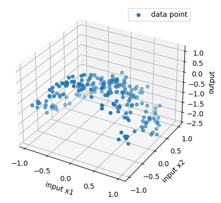
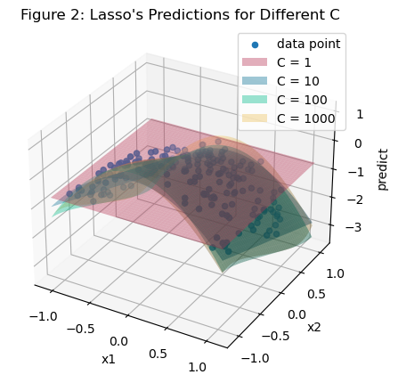
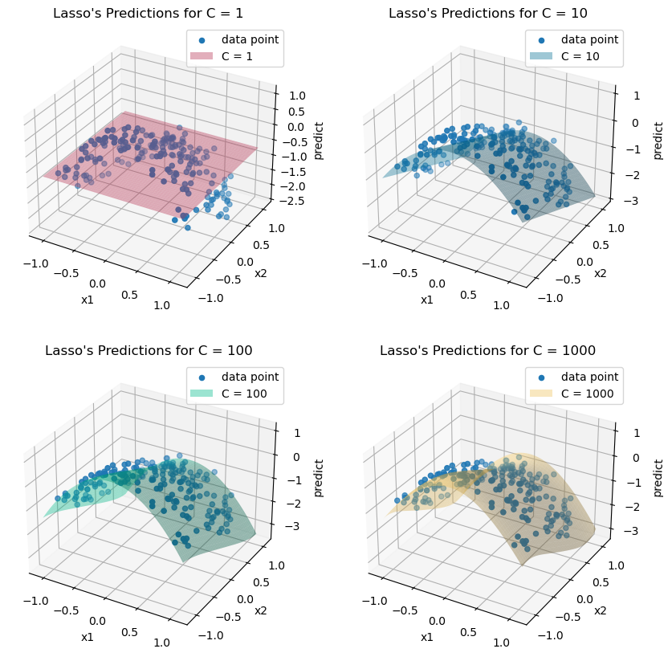
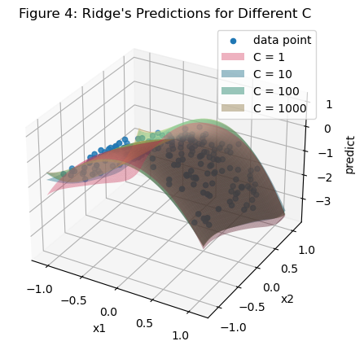
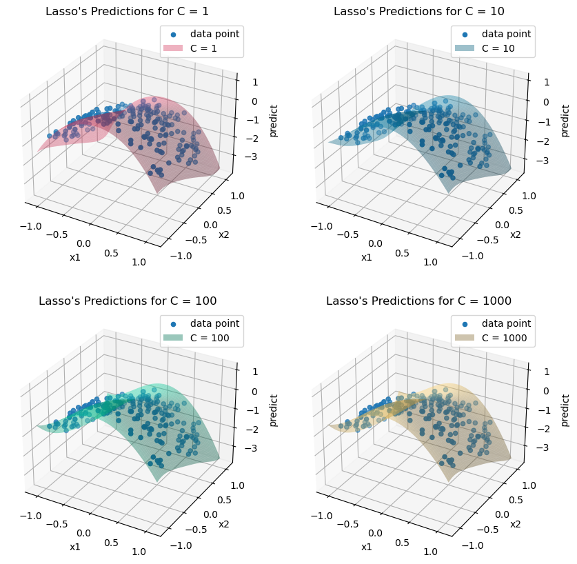
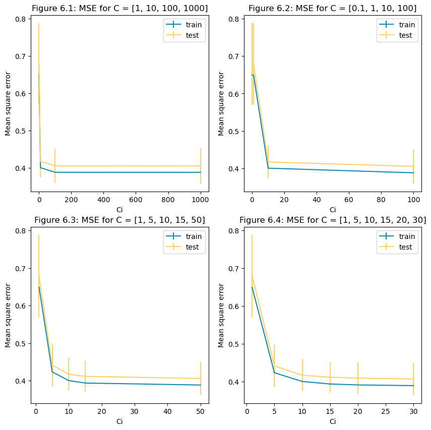
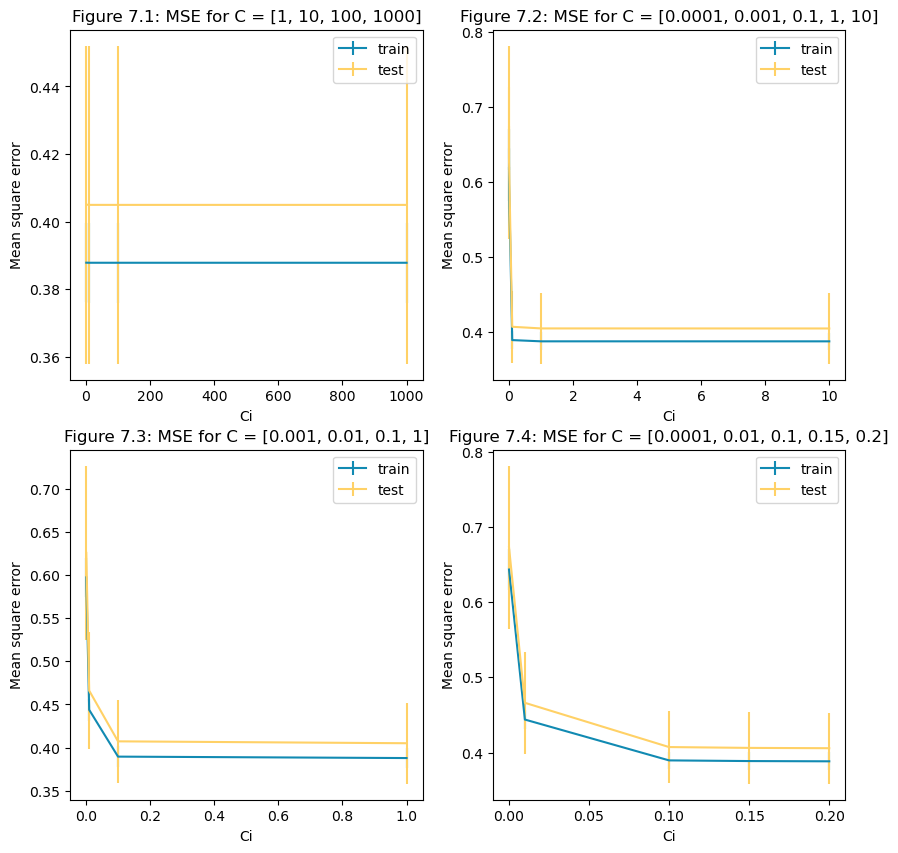

# Solution of Week 3

> Data Id: 1--2--1 

## i

### i.a

Figure 1 shows the data, where $x_1$ and $x_2$ are the different features, and the z-axis shows the output results. It can be seen that the data points are in an upwardly convex curve.

> 
>
> <p align="center">Figure 1: Scatter plot of data</p>

### i.b

Since ${\alpha} = \frac{1}{2*C} $, after repeated adjustment, it is found that in `Lasso` regression models with these polynomial features, when the C value is less than 1, all the fitted feature coefficients are 0. So set the value range of C value to [1, 10, 100, 100]. The obtained model parameter results are as follows:


> <p align="center">Table 1: Coefficients of Lasso Regression</p>
>
> | $C$  | Bias   | $x_1$ | $x_2$  | $x_1^2$ | $x_1x_2$ | $x_2^2$ | $x_1^3$ | $x_1^2x_2$ | $x_1x_2^2$ | $x_2^3$ |
> | ---- | ------ | ----- | ------ | ------- | -------- | ------- | ------- | ---------- | ---------- | ------- |
> | 1    | -0.694 | 0     | 0      | 0       | 0        | 0       | 0       | 0          | 0          | 0       |
> | 10   | -0.199 | 0     | -0.805 | -1.453  | 0        | 0       | 0       | 0          | 0          | 0       |
> | 100  | -0.024 | 0     | -1.025 | -1.991  | 0        | 0       | 0       | 0          | 0          | 0       |
> | 1000 | 0.014  | 0.007 | -1.129 | -2.278  | 0        | -0.037  | 0       | 0          | -0.011     | 0       |
>
> | $x_1^4$ | $x_1^3x_2$ | $x_1^2x_2^2$ | $x_1x_2^3$ | $x_2^4$ | $x_1^5$ | $x_1^4x_2$ | $x_1^3x_2^2$ | $x_1^2x_2^3$ | $x_1x_2^4$ | $x_2^5$ |
> | ------- | ---------- | ------------ | ---------- | ------- | ------- | ---------- | ------------ | ---- | ----------------------- | ---- |
> | 0 | 0 | 0 | 0 | 0 | 0 | 0 | 0 | 0 | 0 | 0 |
> | 0 | 0 | 0 | 0 | 0 | 0 | 0 | 0 | 0 | 0 | 0 |
> | 0 | 0 | 0 | 0 | 0.020 | 0 | 0 | 0 | 0 | 0 | 0.114 |
> | 0.223 | 0 | 0.117 | 0.019 | 0.074 | 0 | 0 | -0.027 | -0.05 | 0 | 0.366 |
>

C = 1

- $y = -0.694$

C = 10

- $y = -0.199 - 0.805 * x_2 - 1.453*x_1^2$

C = 100

- $y=-0.024 - 1.025 * x_2 - 1.991 * x_1^2 + 0.02 * x_2^4 + 0.114 * x_2^5$

C = 1000

- $y = 0.014 + 0.007 * x_1 - 1.129 * x_2 - 2.278 * x_1^2 - 0.037*x_2^2-0.011*x_1x_2^2$

  $ + 0.223*x_1^4+ 0.117*x_1^2x_2^2 + 0.019*x_1x_2^3+0.074*x_2^4 - 0.027 *x_1^2x_2^3$

  $- 0.05*x_1^2x_2^3 + 0.366 * x_2^5$

From the above table and the model, it can be seen that as the value of C increases, the number of polynomial features with coefficients of 0 decreases. Since ${\alpha} = \frac{1}{2*C} $, it can be seen that as C gradually increases, the value of ${\alpha}$ decreases and the penalty on the individual features of the model decreases. The penalty term exists to de-penalize the larger coefficients and to try to distribute the weights more evenly. So when the value of C is small, the penalty is large, and it may cause some of the coefficients of variables that are not very important to become 0. This is why when the value of C is small, the model has more values of coefficients of 0 for the features, and as the value of C increases, many of the features gradually appear in the model.

### i.c

> 
>
> <p align="center">Figure 2: Lasso's Predictions for Different C</p>

Using the `plot_surface` function, `Lasso`'s Predictions for different values of C can be displayed in a single plot in Figure 2. Since the data set itself is a concave graphical facing downwards, it can be seen that `Lasso`'s fitted graph becomes increasingly curved as the value of C increases. The specific bending changes can be seen in Figure 3.

> 
>
> <p align="center">Figure 3: Lasso's Predictions for Different C</p>

### i.d

#### under-fitting

When a statistical model or machine learning algorithm fails to capture the underlying trends in the data because it ignores many important data points, it is said to be under-fitting, i.e., it only performs well on the training data and poorly on the test data.

#### Over-fitting

When a statistical model or machine learning algorithm does not make accurate predictions on testing data because it takes into account many unimportant data points such as details and noise, it is called over-fitting.

---

The C-value is an important part of the penalty term, the value of the C-value determines the value of the penalty term. And the purpose of the penalty term is to equalize the coefficients of the individual features. It can be learned from i.b and i.c that in the `Lasso` model when the C-value is too small, it leads to too much penalty, and in the simulation fitting results, some feature variables are lost, which leads to an under-fitting of the model. When the C-value is too large, it leads to less penalty, and in the simulation results, the model is over-fitted due to the excessive consideration of noise. Therefore, the penalty is continuously reduced by continuously increasing the value of C gradually when the model is under-fitting. Before over-fitting, some C values must allow the model to correctly classify the data points.

### i.e

By setting the value range of C value to [1, 10, 100, 100], the obtained model parameter results are as follows:

> <p align="center">Table 2: Coefficients of Ridge Regression</p>
>
> | $C$  | Bias   | $x_1$  | $x_2$  | $x_1^2$ | $x_1x_2$ | $x_2^2$ | $x_1^3$ | $x_1^2x_2$ | $x_1x_2^2$ | $x_2^3$ |
> | ---- | ------ | ------ | ------ | ------- | -------- | ------- | ------- | ---------- | ---------- | ------- |
> | 1    | -0.059 | -0.033 | -1.051 | -1.680  | -0.013   | -0.026  | 0.008   | -0.036     | 0.124      | -0.031  |
> | 10   | 0.047  | -0.082 | -1.178 | -2.349  | 0.068    | -0.195  | 0.121   | 0.129      | 0.422      | 0.101   |
> | 100  | 0.073  | -0.138 | -1.216 | -2.524  | 0.129    | -0.245  | 0.299   | 0.129      | 0.599      | 0.189   |
> | 1000 | 0.076  | -0.149 | -1.221 | -2.546  | 0.140    | -0.252  | 0.336   | 0.124      | 0.627      | 0.203   |
>
> | $x_1^4$ | $x_1^3x_2$ | $x_1^2x_2^2$ | $x_1x_2^3$ | $x_2^4$ | $x_1^5$ | $x_1^4x_2$ | $x_1^3x_2^2$ | $x_1^2x_2^3$ | $x_1x_2^4$ | $x_2^5$ |
> | ------- | ---------- | ------------ | ---------- | ------- | ------- | ---------- | ------------ | ------------ | ---------- | ------- |
> | -0.349  | -0.002     | -0.11        | 0.042      | 0.128   | 0.056   | -0.108     | -0.141       | -0.044       | -0.022     | 0.288   |
> | 0.282   | -0.127     | 0.178        | 0.011      | 0.226   | -0.012  | -0.031     | -0.435       | -0.233       | -0.216     | 0.345   |
> | 0.458   | -0.233     | 0.276        | -0.018     | 0.253   | -0.151  | 0.082      | -0.633       | -0.320       | -0.314     | 0.312   |
> | 0.481   | -0.251     | 0.289        | -0.024     | 0.257   | -0.180  | 0.104      | -0.667       | -0.332       | -0.329     | 0.306   |
>

C = 1

- $y = -0.059-0.033*x_1-1.051*x_2-1.68*x_1^2-0.013*x_1x_3-0.026*x_2^2$

  $+0.008*x_1^3-0.036*x_1x_2^2-0.031*x_2^3-0.349*x_1^4-0.002*x_1^3x_2$

  $-0.11*x_1^2x_2^2+0.042*x_1x_2^3+0.128*x_2^4+0.056*x_1-0.108*x_1^4x_2$

  $-0.141*x_1^2x_2^3-0.044*x_1^2x_2^3-0.022*x_1x_2^4+0.288*x_2^5$

C = 10

- $y = 0.047-0.082*x_1-1.178*x_2-2.349*x_1^2+0.068*x_1x_3-0.195*x_2^2$

  $+0.121*x_1^3+0.129*x_1x_2^2+0.101*x_2^3+0.282*x_1^4-0.127*x_1^3x_2$

  $+0.178*x_1^2x_2^2+0.011*x_1x_2^3+0.226*x_2^4-0.012*x_1-0.031*x_1^4x_2$

  $-0.435*x_1^2x_2^3-0.233*x_1^2x_2^3-0.216*x_1x_2^4+0.345*x_2^5$

C = 100

- $y = 0.073-0.138*x_1-1.216*x_2-2.524*x_1^2+0.129*x_1x_3-0.245*x_2^2$

  $+0.299*x_1^3+0.599*x_1x_2^2+0.189*x_2^3+0.458*x_1^4-0.233*x_1^3x_2$

  $+0.276*x_1^2x_2^2-0.018*x_1x_2^3+0.253*x_2^4-0.151*x_1+0.082*x_1^4x_2$

  $-0.633*x_1^2x_2^3-0.320*x_1^2x_2^3-0.314*x_1x_2^4+0.312*x_2^5$

C = 1000

- $y = 0.076-0.149*x_1-1.221*x_2-2.546*x_1^2+0.140*x_1x_3-0.252*x_2^2$

  $+0.336*x_1^3+0.627*x_1x_2^2+0.203*x_2^3+0.481*x_1^4-0.251*x_1^3x_2$

  $+0.289*x_1^2x_2^2-0.024*x_1x_2^3+0.257*x_2^4-0.180*x_1+0.104*x_1^4x_2$

  $-0.667*x_1^2x_2^3-0.332*x_1^2x_2^3-0.329*x_1x_2^4+0.306*x_2^5$

Plot `Ridge` predictions on a 3D data plot and also show the training data in Figure 4:  

> 
>
> <p align="center">Figure 4: Ridge's Predictions for Different C</p>

> 
>
> <p align="center">Figure 5: Ridge's Predictions for Different C</p>

It is easy to observe from the above table that the same C values do not give the same regression results for the two models, and for the `Ridge` model, the number of coefficients that are zero is much less than for the `Lasso` model.


## ii

### ii.a

Figure 6.1 presents the plot of `Mean Square Error` by plotting the values of C in the range [1, 10, 100, 1000]. It is easy to see that `Mean Square Error` stabilizes long before C is 200. So narrowing the range of C to [0.1, 1, 10, 100], the results are shown in Figure 6.2. But it is found that the rapidly changing values of `Mean Square Error` are still not observed from 10 to 100. by narrowing the range of C again to Figure 6.4, it is found that `Mean Square Error` stabilizes after a value of C of 5 with little change.

> 
>
> <p align="center">Figure 6: Mean Square Error of Lasso for Different Ranges of C </p>

### ii.b

As can be seen from the graph in Figure 6.4, the value of `Mean Square Error` gradually stabilizes after C=5, and the error between the results of the test set and the training set is also very small here, representing a good fit of the model at this moment. Taking error bars into account, a choice of C around 5 is recommended.

### ii.c

The results of the `Mean Square Error` of the `Ridge` model for different ranges of C values are plotted in Figure 7 by progressively adjusting the range of C.

> 
>
> <p align="center">Figure 7: Mean Square Error of Ridge for Different Ranges of C </p>

As can be seen from the graph in Figure 7.4, the value of `Mean Square Error` gradually stabilizes after C=0.01, and the error between the results of the test set and the training set is also very small here, representing a good fit of the model at this moment. Taking error bars into account, the choice of C around 0.01 is recommended.


## Appendix

```python
# id:1--2--1

import numpy as np
import matplotlib.pyplot as plt
from sklearn.model_selection import train_test_split
from sklearn.linear_model import Lasso
from sklearn.pipeline import Pipeline
from sklearn.metrics import mean_squared_error
from sklearn.preprocessing import PolynomialFeatures
from sklearn.linear_model import Ridge
from sklearn.model_selection import KFold

data = np.loadtxt('week3.txt', delimiter=',')
X = data[:, :2]
y = data[:, 2]

# i.a
fig = plt.figure()

ax = fig.add_subplot(111, projection='3d')
ax.scatter(data[:, 0], data[:, 1], data[:, 2], label="data point")
ax.set_xlabel('input x1')
ax.set_ylabel('input x2')
ax.set_zlabel('output')
plt.legend(loc='best')
plt.title("Figure 1: Scatter plot of data")
plt.show()

# 1.b
np.random.seed(333)
# Use the train:test to divide the dataset with a ratio of 2:8
x_train, x_test, y_train, y_test = train_test_split(X, y, test_size=0.2, random_state=1)


class TrainModel:
    """
    Define a class that trains the results of the corresponding regression model
    based on the desired model type and corresponding parameters,
    and plots the corresponding graphs as required
    """
    model_class = None
    data = None
    degree = 1
    c_list = []
    model_list = []
    pred_list = []
    fig = None
    ax = None
    X1 = None
    X2 = None
    colors = ['#ef476f', '#118ab2', '#06d6a0', '#ffd166']

    def __init__(self, model_class, data, degree, c_list):
        self.model_class = model_class
        self.data = data
        self.degree = degree
        self.c_list = c_list
        self.get_model()

    def ModelRegression(self, alpha):
        return Pipeline([
            ('poly', PolynomialFeatures(degree=self.degree)),
            ('reg', self.model_class(alpha=alpha))
        ])

    def get_coef(self, model):
        return model.named_steps['reg'].coef_

    def get_intercept(self, model):
        return model.named_steps['reg'].intercept_

    def get_model(self):
        self.model_list = []
        self.pred_list = []
        # Train different models by different values of C
        for c in self.c_list:
            reg = self.ModelRegression(1 / (2 * c))
            model = reg.fit(x_train, y_train)
            pred = reg.predict(x_test)

            self.model_list.append(model)
            self.pred_list.append(pred)

    def print_coefficients(self):
        for model in self.model_list:
            print(self.get_coef(model), self.get_intercept(model))

    def draw_origin(self, ax):
        """
        Get the maximum and minimum values of the original feature variables,
        expand 0.1 on this basis, and use them to display the plane
        """
        x1 = np.linspace(self.data[:, 0].min() - 0.1, self.data[:, 0].max() + 0.1)
        x2 = np.linspace(self.data[:, 1].min() - 0.1, self.data[:, 1].max() + 0.1)
        self.X1, self.X2 = np.meshgrid(x1, x2)

        ax.set_xlabel('x1')
        ax.set_ylabel('x2')
        ax.set_zlabel('predict')
        ax.scatter(self.data[:, 0], self.data[:, 1], self.data[:, 2], label="data point")

    def draw_total(self):
        self.fig = plt.figure(figsize=(5, 5))
        ax = self.fig.add_subplot(111, projection='3d')
        self.draw_origin(ax)

        for i in range(1, len(self.model_list) + 1):
            self.draw_surface(ax, i)
        plt.legend()

        plt.title("Predictions for Different C")
        plt.show()

    def draw_single(self):
        self.fig = plt.figure(figsize=(10, 10))
        for i in range(1, len(self.model_list) + 1):
            ax = self.fig.add_subplot(2, 2, i, projection='3d')

            self.draw_origin(ax)
            self.draw_surface(ax, i)

            plt.legend()
            plt.title("Predictions for C = {}".format(self.c_list[i - 1]))
        plt.show()

    def draw_surface(self, ax, i):
        Z = []
        for j in range(len(self.X1)):
            temp = np.column_stack((self.X1[j], self.X1[j]))
            Z.append(self.model_list[i - 1].predict(temp))
        Z = np.array(Z)
        surf = ax.plot_surface(self.X1, self.X2, Z, label="C = {}".format(self.c_list[i - 1]), color=self.colors[i - 1], alpha=0.4)
        surf._facecolors2d = surf._facecolor3d
        surf._edgecolors2d = surf._edgecolor3d


lasso_reg = TrainModel(model_class=Lasso, data=data, degree=5, c_list=[1, 10, 100, 1000])
lasso_reg.print_coefficients()
lasso_reg.draw_total()
lasso_reg.draw_single()

ridge_reg = TrainModel(model_class=Ridge, data=data, degree=5, c_list=[1, 10, 100, 1000])
ridge_reg.print_coefficients()
ridge_reg.draw_total()
ridge_reg.draw_single()


def draw_mean(model_class, c_list):
    fig = plt.figure(figsize=(10, 10))
    for i, c_range in enumerate(c_list):
        ax = fig.add_subplot(2, 2, i + 1)
        train_mean_error = []
        train_std_error = []
        test_mean_error = []
        test_std_error = []

        for c in c_range:
            model = model_class(alpha=1 / (2 * c))

            train_temp = []
            test_temp = []
            kf = KFold(n_splits=5)

            # Solve MSE for each categorical data
            for train, test in kf.split(X):
                model.fit(X[train], y[train])
                train_pred = model.predict(X[train])
                test_pred = model.predict(X[test])

                train_temp.append(mean_squared_error(y[train], train_pred))
                test_temp.append(mean_squared_error(y[test], test_pred))

            train_mean_error.append(np.array(train_temp).mean())
            train_std_error.append(np.array(train_temp).std())
            test_mean_error.append(np.array(test_temp).mean())
            test_std_error.append(np.array(test_temp).std())

        ax.errorbar(c_range, train_mean_error, yerr=train_std_error, c='#118ab2', label='train')
        ax.errorbar(c_range, test_mean_error, yerr=test_std_error, c='#ffd166', label='test')
        plt.xlabel('Ci')
        plt.ylabel('Mean square error')
        plt.legend()
        plt.title("{}: MSE for C = {}".format(i + 1, c_range))
    plt.show()


# ii.a
# Adjust different C values for training Lasso
C_range1 = [
    [1, 10, 100, 1000],
    [0.1, 1, 10, 100],
    [1, 5, 10, 15, 50],
    [1, 5, 10, 15, 20, 30]
]
draw_mean(Lasso, C_range1)

# ii.c
# Adjust different C values for training Ridge
C_range2 = [
    [1, 10, 100, 1000],
    [0.0001, 0.001, 0.1, 1, 10],
    [0.001, 0.01, 0.1, 1],
    [0.0001, 0.01, 0.1, 0.15, 0.2],
]
draw_mean(Ridge, C_range2)
```

