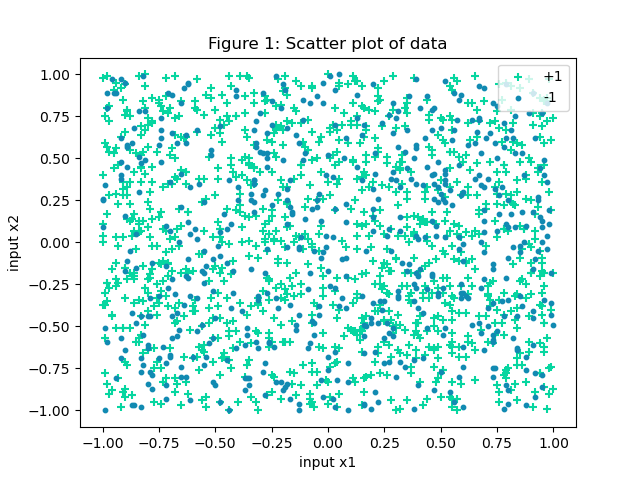
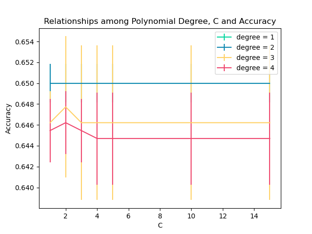
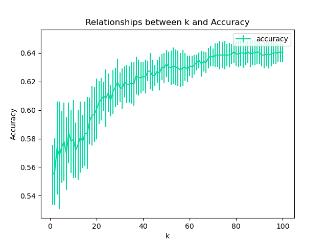
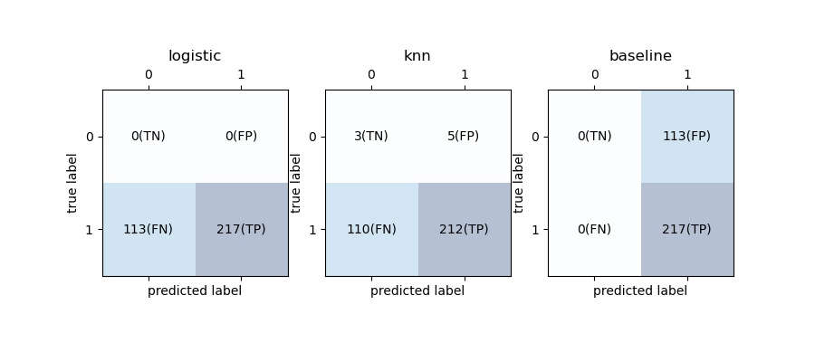
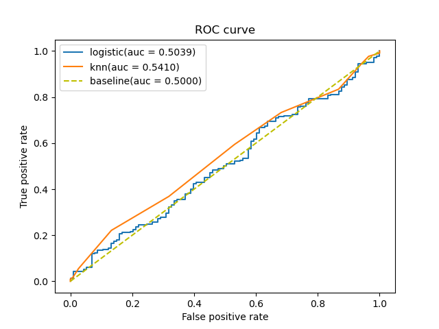
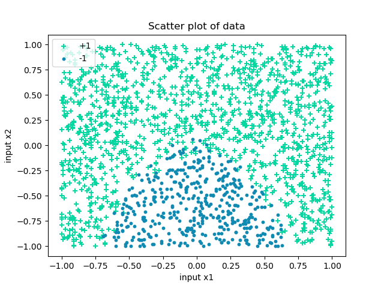
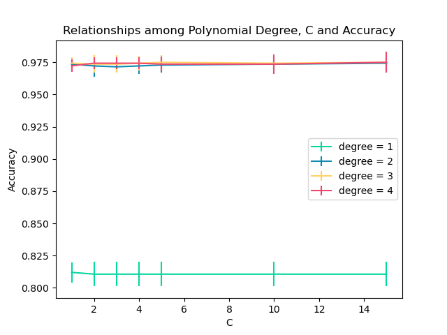
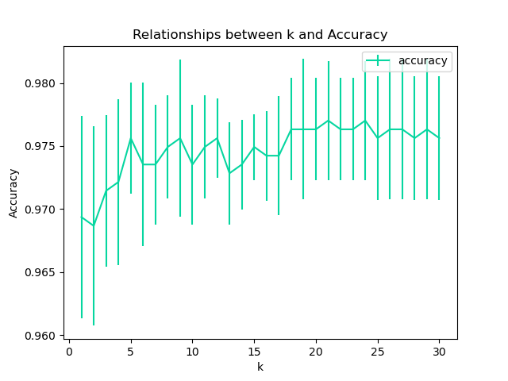
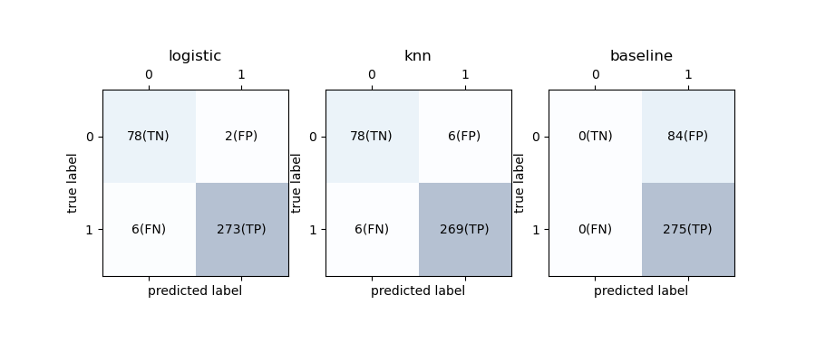
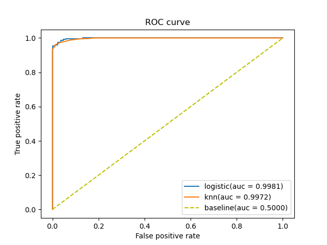

# Solution of Week 4

> Data Id: 25-50-25-1 


## i - Dataset 1

### i.a

Figure 1 shows the data, where $x_1$ and $x_2$ are the different input features, and using the different colours to distinguish the different output results in the green plus sign being +1 points, and the blue dot sign being -1 points.

> 
>
> <p align="center">Figure 1: Scatter plot of data</p>

It can be seen from the figure that the distribution of the data is very chaotic, and it is difficult to use a model to demarcate its boundaries, but try using `Logistic Regression` and `knn` model fitting.

After using the `train_test_split` function to divide the dataset into a training set and a test set, the training set is substituted into the `PolynomialFeatures` function and the `LogisticRegression` function through the preset different $C$ values and degree values. Use the `cross_val_score` function to use cross-validation to ensure that the model does not over-fit, and to divide the training set data into different parts for cross-validation. 

After many debugs, the range of penalty term $C$ is finally determined as: [1, 2, 3, 4, 5, 10, 15], and the range of polynomial degree is: [1, 2, 3, 4]. 

Since this is a classification task, using `accuracy` is more suitable for evaluating this model. Using the `errorbar` function can get the `accuracy` value under different $C$ values and different degree values.

> 
>
> <p align="center">Figure 2: Relationships among Polynomial Degree, C and Accuracy</p>

As can be seen from the figure, when the value of **$degree$ is 2**, the accuracy of the model reaches the maximum value of 0.650. At this time, the value of $C$ has almost no effect on the result of the `accuracy`, so choose **$C$ = 1**.

### i.b

Due to the confusion of the data, it was found during the debugging process that the value of $k$ had a great influence on the `accuracy` of the model in the initial stage, but when the value of $k$ was greater than 60, the `accuracy` value gradually became stable.

Therefore, it was finally decided to set the range of $k$ to be [1, 2, 3, ..., 100], so that the accuracy can be better presented as the value of k changes.

> 
>
> <p align="center">Figure 3: Relationship between k and Accuracy</p>

In the process of visualization, when **k=79**, the maximum `accuracy` is obtained, and the value is 0.6409.

### i.c

A **confusion matrix**, also known as an error matrix, is a specific table layout that allows visualization of the performance of an algorithm. 

By comparing i.a and i.b, the `logistic` parameters and `knn` parameters obtained from the training set data, the `confusion matrix` of the corresponding model can be solved by using the `confusion_matrix` function. Again, in order to compare the performance of the models, a baseline model is introduced, which always predicts the most frequent class in the training data.

By using the `matshow` function, the confusion matrix results for each model are displayed in one graph.

> 
>
> <p align="center">Figure 4: Confusion Matrix of different models</p>

As can be seen from the figure, the TP values of the three models are relatively high, indicating that the actual and model fitting results are the same and there are many positive points. However, the TN values are all very low, indicating that the actual and model-fitting results are the same, and there are very few negative points. This is not good news for the fitting results of the model. The FN values of the `logistic` model and the `knn` model are both high, indicating that the actual value is positive, but the model predicts that it is negative. It shows that the two models have large errors in this part of the data.

### i.d

`Roc curve` takes the proportion of predicted positive examples that are actually positive in all positive examples as the vertical axis, and the predicted positive examples that are actually negative in all negative examples as the horizontal axis , which can effectively analyze the situation of the model. 

By using the `Roc_curve` function and the `auc` function, the curve of `Roc` can be drawn, and which model has better prediction results can be judged according to the value of `auc`.

> 
>
> <p align="center">Figure 5: ROC curve and auc of different models</p>

### i.e

Criteria for judging the quality of a classifier (prediction model) from `auc`:

- `auc` = 1, which is a perfect classifier.
- 0.5 < `auc` < 1, better than random guessing. 
- `auc` = 0.5, the following random guesses the same, the model has no predictive value.
- `auc` < 0.5, worse than random guessing.

From the value of `auc` of Figure 5, it can be seen that whether it is the `logistic` model or the `knn` model, the prediction result of the instance is only a little better than the result of the baseline model. Among them, the value of `knn` is 0.5410, which is larger than the 0.5039 of `logistics`.

It can be seen that the fitting result of the baseline model is the same as the random guessing result, both of which are 0.5.

So if you have to recommend a model, I would recommend the `knn` model.

## ii - Dataset 2

### ii.a

Use a scatter plot as i.a to present the data points. The green plus sign represents +1 points, and the blue points represent -1 points.

> 
>
> <p align="center">Figure 6: Scatter plot of data</p>

After debugging different $C$ values and $degree$ values， the range of penalty term $C$ is finally determined as: [1, 2, 3, 4, 5, 10, 15], and the range of polynomial $degree$ is: [1, 2, 3, 4]. 

这里也选用`accuracy`作为评估标准。当`accuracy`值最大的时候，选取对应的$C$值与$degree$值。

> 
>
> <p align="center">Figure 7: Relationships among Polynomial Degree, C and Accuracy</p>

When the `accuracy` is 0.9749, it is the largest, at this time the $C$ value is 5 and the $degree$ is 3.

### ii.b

Different from data one, the accuracy of the model tends to be stable when k is about 20, so the range of k is set to [1,2,3,...,30].

> 
>
> <p align="center">Figure 8: Relationship between k and Accuracy</p>

In the process of visualization, when **k=21**, the maximum `accuracy` is obtained, and the value is 0.977.

### ii.c

To compare the performance of the models, a baseline model is introduced, which always predicts the **most frequent class** in the training data.

By using the `matshow` function, the confusion matrix results for each model are displayed in one graph.

> 
>
> <p align="center">Figure 9: Confusion Matrix of different models</p>

It can be seen from the figure that the TP and TN values of the `logistic` model and the `knn` model are very high, indicating that the actual situation in the data is the same as the model simulation situation. And the values of FP and FN are very small, indicating that the predicted results are rarely in line with the actual. These characteristics can indicate that these models fit well.

### ii.d

`Roc curve` takes the proportion of predicted positive examples that are actually positive in all positive examples as the vertical axis, and the predicted positive examples that are actually negative in all negative examples as the horizontal axis , which can effectively analyze the situation of the model. 

By using the `Roc_curve` function and the `auc` function, the curve of `Roc` can be drawn, and which model has better prediction results can be judged according to the value of `auc`.

> 
>
> <p align="center">Figure 10: ROC curve and auc of different models</p>

### ii.e

Criteria for judging the quality of a classifier (prediction model) from `auc`:

- `auc` = 1, which is a perfect classifier.
- 0.5 < `auc` < 1, better than random guessing. 
- `auc` = 0.5, the following random guesses the same, the model has no predictive value.
- `auc` < 0.5, worse than random guessing.

It can be seen that the fitting results of the `logistic` and `knn` models are very good, and the `auc` values of these two models are very close to 1. The value of `auc` of `logistic` is 0.9981, and the value of `auc` of `knn` is 0.9972. 

It can be seen that the fitting result of the baseline model is the same as the random guessing result, both of which are 0.5.

The value of `logistic` is slightly larger than `knn`. So if you have to recommend a model, I would recommend the `logistic` model.


## Appendix

```python
# id:25-50-25-1

import numpy as np
from sklearn.model_selection import cross_val_score
import matplotlib.pyplot as plt
from sklearn.preprocessing import PolynomialFeatures
from sklearn.linear_model import LogisticRegression
from sklearn.model_selection import train_test_split
from sklearn.neighbors import KNeighborsClassifier
from sklearn.metrics import confusion_matrix, roc_curve, auc, classification_report
from sklearn.dummy import DummyClassifier

# load dataset
# data = np.loadtxt('../03_Code/week4_1.txt', delimiter=',')
data = np.loadtxt('../03_Code/week4_2.txt', delimiter=',')
X = data[:, :2]
Y = data[:, 2]

# show scatter of whole dataset
X1 = data[data[:, 2] == 1]
X2 = data[data[:, 2] == -1]

fig = plt.figure()
ax = fig.add_subplot(1, 1, 1)
ax.scatter(X1[:, 0], X1[:, 1], marker='+', color='#06d6a0', label='+1')
ax.scatter(X2[:, 0], X2[:, 1], marker='o', color='#118ab2', s=10, label='-1')
ax.set_xlabel('input x1')
ax.set_ylabel('input x2')
ax.legend(loc='best')
plt.title("Scatter plot of data")
plt.show()

# split dataset to train set and test set
x_train, x_test, y_train, y_test = train_test_split(X, Y, test_size=0.2, random_state=77)


# tuning logistic params
def logi_tune_params(c_list, degree_list, x, y, cv=5):
    colors = ['#06d6a0', '#118ab2', '#ffd166', '#ef476f']
    best_score = 0
    best_c = 0
    best_degree = 0

    for i, degree in enumerate(degree_list):
        x_poly = PolynomialFeatures(degree).fit_transform(x)
        accuracy = []
        accuracy_std = []
        for c in c_list:
            model = LogisticRegression(penalty='l2', C=c, solver='lbfgs', max_iter=1000)
            train_score = cross_val_score(model, x_poly, y, cv=cv, scoring='accuracy')
            model.fit(x_poly, y)

            accuracy.append(train_score.mean())
            accuracy_std.append(train_score.std())

            # get the best k and score
            curr_score = train_score.mean()
            if curr_score > best_score:
                best_score = curr_score
                best_c = c
                best_degree = degree

        plt.errorbar(c_list, accuracy, yerr=accuracy_std, c=colors[i], label='degree = {}'.format(degree))
    plt.xlabel('C')
    plt.ylabel('Accuracy')
    plt.legend()
    plt.title("Relationships among Polynomial Degree, C and Accuracy")
    plt.show()

    return best_c, best_degree, best_score


C_range = [1, 2, 3, 4, 5, 10, 15]
degree_range = [1, 2, 3, 4]
best_c_logic, best_degree, best_score_logic = logi_tune_params(C_range, degree_range, x_train, y_train)
print(best_c_logic, best_degree, best_score_logic)


# tuning knn params
def knn_tune_params(k_list, x, y, cv=5):
    accuracy = []
    accuracy_std = []
    best_score = 0
    best_k = 0

    for i, k in enumerate(k_list):
        knn_clf = KNeighborsClassifier(n_neighbors=k, weights='distance')
        knn_clf.fit(x, y)

        scores = cross_val_score(knn_clf, x, y, cv=cv, scoring='accuracy')
        accuracy.append(scores.mean())
        accuracy_std.append(scores.std())

        # get the best k and score
        curr_score = scores.mean()
        if curr_score > best_score:
            best_score = curr_score
            best_k = k

    print(best_score, best_k)
    plt.errorbar(k_list, accuracy, yerr=accuracy_std, c='#06d6a0', label='accuracy')
    plt.xlabel('k')
    plt.ylabel('Accuracy')
    plt.legend()
    plt.title("Relationships between k and Accuracy")
    plt.show()

    return best_k, best_score


k_range = np.linspace(1, 30, 30, dtype=int)
best_k_knn, best_score_knn = knn_tune_params(k_range, x_train, y_train)

# calculate the matrix of logistic model, knn model and baseline model
# logistic
x_logis = PolynomialFeatures(best_degree).fit_transform(x_train)
x_test_logis = PolynomialFeatures(best_degree).fit_transform(x_test)

model_logis = LogisticRegression(penalty='l2', C=best_c_logic)
model_logis.fit(x_logis, y_train)

y_pred_logis = model_logis.predict(x_test_logis)
mat_logis = confusion_matrix(y_pred_logis, y_test)
print(mat_logis)

# Knn
model_knn = KNeighborsClassifier(n_neighbors=best_k_knn, weights='distance')
model_knn.fit(x_train, y_train)
y_pred_knn = model_knn.predict(x_test)
mat_knn = confusion_matrix(y_pred_knn, y_test)
print(mat_knn)

# Baseline
model_dummy = DummyClassifier(strategy="most_frequent").fit(x_train, y_train)
y_pred_dummy = model_dummy.predict(x_test)
mat_dummy = confusion_matrix(y_test, y_pred_dummy)
print(mat_dummy)


def draw_matrix(confmat, title):
    text_list = ['TN', 'FP', 'FN', "TP"]

    ax.matshow(confmat, cmap=plt.cm.Blues, alpha=0.3)
    text_index = 0
    for i in range(confmat.shape[0]):
        for j in range(confmat.shape[1]):
            ax.text(x=j, y=i, s=str(confmat[i, j]) + str('({})').format(text_list[text_index]),
                    va='center', ha='center')
            text_index += 1
    plt.xlabel('predicted label')
    plt.ylabel('true label')
    plt.title(title)


fig = plt.figure(figsize=(9, 4))
ax = fig.add_subplot(1, 3, 1)
draw_matrix(mat_logis, 'logistic')
ax = fig.add_subplot(1, 3, 2)
draw_matrix(mat_knn, 'knn')
ax = fig.add_subplot(1, 3, 3)
draw_matrix(mat_dummy, 'baseline')
plt.show()

# draw the roc curve of these models
x_logis = PolynomialFeatures(2).fit_transform(x_train)
x_test_logis = PolynomialFeatures(2).fit_transform(x_test)

model_logis = LogisticRegression(penalty='l2', C=5).fit(x_logis, y_train)
fpr1, tpr1, _ = roc_curve(y_test, model_logis.decision_function(x_test_logis))
roc_auc1 = auc(fpr1, tpr1)
plt.plot(fpr1, tpr1, label='logistic(auc = %0.4f)' % (roc_auc1))

model_knn = KNeighborsClassifier(n_neighbors=18, weights='uniform').fit(x_train, y_train)
fpr2, tpr2, _ = roc_curve(y_test, model_knn.predict_proba(x_test)[:, 1])
roc_auc2 = auc(fpr2, tpr2)
plt.plot(fpr2, tpr2, label='knn(auc = %0.4f)' % (roc_auc2))

dummy = DummyClassifier(strategy="most_frequent").fit(x_train, y_train)
fpr3, tpr3, _ = roc_curve(y_test, dummy.predict_proba(x_test)[:, 1])
roc_auc3 = auc(fpr3, tpr3)
plt.plot(fpr3, tpr3, c='y', label='baseline(auc = %0.4f)' % (roc_auc3), linestyle='--')

plt.xlabel('False positive rate')
plt.ylabel('True positive rate')
plt.title('ROC curve')
plt.legend(loc='best')
plt.show()

```

