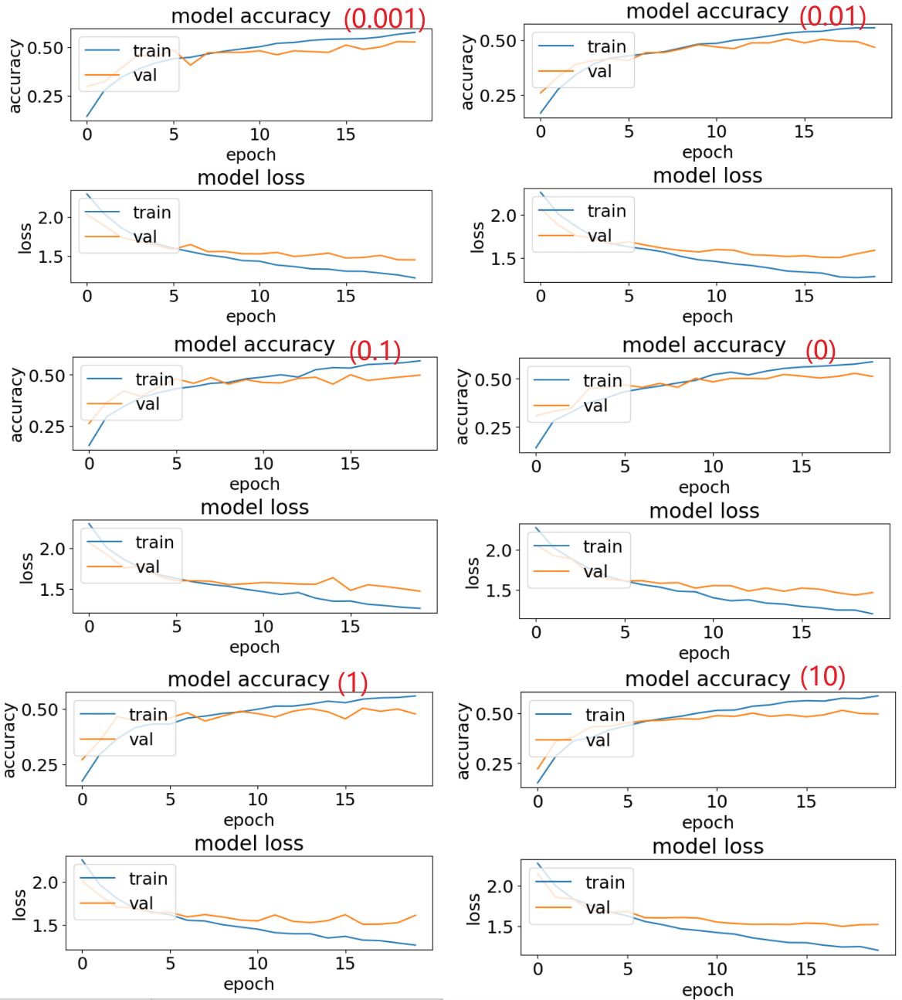

# Solution of Week 8

## i

### a

Since the convolution process is based on the size of the kernel, it traverses the input data, multiplies matrix multiplication with the kernel, and assigns the final result to the new data, so that each point can be traversed to complete the convolution operation. And if you want the output result to have the same number of rows and columns as the input matrix, you need to perform boundary padding on the input matrix, which can be filled with 0 by default.

The specific implementation steps of the convolution function are as follows: 

1. Obtain the shape value of the input data, and directly create a matrix of the same size through the `NumPy.zeros()` function
2. Use the `Numpy.pad()` function to fill the boundary of the input data according to the size of the kernel
3. Traverse each row and column of the input data after boundary filling, select the data according to the kernel size, and then use the `NumPy.multiply()` function to perform matrix operations with the kernel, and finally use the `NumPy.sum()` function to perform matrix operations and add the results to get a new value
4. Since the picture has a range limit of 0-255, use the `NumPy.clip()` function to limit the result so that all values greater than 255 are changed to 255 and less than 0 are changed to 0, and the value of the entire matrix is limited between 0-255.

```python
def conv(arr, k):
    """
    vanilla python convolve  
    :param arr: input data
    :param k: kernel
    :return: convolve result
    """
    h, w = arr.shape
    new_arr = np.zeros((h, w), dtype=arr.dtype)
    kl = len(k)

    tmp_arr = np.pad(arr, (1, 1))

    for i in range(h):
        for j in range(w):
            tmp = np.sum(np.multiply(tmp_arr[i:i + kl, j:j + kl], k))
            new_arr[i][j] = np.clip(tmp, 0, 255)
    return new_arr
```

### b

Load the picture through the `PIL` framework, and take out the **B (Blue)** channel, pass the channel value together with **kernel_1** and **kernel_2** into the convolution function of *1.a*, save the result using the `PIL` framework, and get the following results:

> 
>
> <p align="center">Figure 1: B channel, image of the convolution result of kernel 1 and kernel 2</p>

It can be seen that the main function of this kernel is to highlight the edge, and the difference between the two kernels is the degree of highlighting.

## ii

### a

As can be seen from the running results of the provided code, the model has the following architectures:

1. **Input** Layer: it uses 16 filters to enlarge the number of channels to 16. Using the 'same' model padding, the output shape is $32 * 32$, the kernel is a 3*3 matrix and it has 448 parameters.
2. **Convolution** Layer: it has 16 filters, and the number of channels is the same as 16. But the value of stride is 2, so the output shape will reduce to $16*16$, and the kernel is still a $3 * 3$ matrix.
3. **Convolution** Layer: it uses 32 filters, and the number of channels is 32. Using the 'same' model padding, the output shape is $16 * 16$, and the kernel is a $3 * 3$ matrix. 
4. **Convolution** Layer: it uses 32 filters, and the number of channels is 32. But the value of stride is 2, so the output shape will reduce to $8*8$, and the kernel is still a $3 * 3$ matrix.
5. **Dropout** Layer: the parameter is 0.5. The Dropout layer randomly sets input units to 0 with a frequency of `rate`(0.5 here) at each step during training time, which helps prevent over-fitting. 
6. **Flatten** Layer: it will flatten the input, and the output shape is **2048**.
7. **Fully-connected** Layer: Classification is performed by using the `SoftMax` function, and an `L1-regularizer` with a value of 0.0001 is used to prevent over-fitting. The output shape is **10**.

### b

#### 1

According to the output results of the model, the total number of parameters is 37146. The layer with the most parameters is the **Fully-connected** layer, because the **Fully-connected** generally converts the two-dimensional feature map output by the convolution into a one-dimensional vector, and each node of the **fully-connected** layer is connected to each node of the previous layer. Combine the output features of the previous layer, so the weight parameters of this layer are the most.

The `accuracy` of the training data was **0.62**, and the `f1-score` reached **0.75**. The accuracy of the test set is only **0.48**, and the `f1-score` value is only **0.63**. Therefore, it can be seen that the effect of the training set is better than that of the test data, probably because the parameters of the model are updated based on the training set.

Create a baseline model based on always predicting the most common label, and use the following algorithm to obtain the accuracy of the train set and test set baseline.

```python
_, train_counts = np.unique(y_train, return_counts=True)
print("baseline train data accuracy: ", train_counts.max() / y_train.shape[0])

_, test_counts = np.unique(y_test, return_counts=True)
print("baseline test data accuracy: ", test_counts.max() / y_test.shape[0])
```

Among them, the `np.unique()` function can find the unique elements of an array, and the `return_counts` parameter represents also return the number of times each unique item appears. Then use the `max()` function to obtain the number of labels of the most common among them, and compare them with the total labels to obtain the accuracy.

The accuracy of train data in the baseline is **0.104**, and the test data is **0.1**. It can be seen that the training results of the model are much better than the baseline.

#### 2

The accuracy images of the training set and the verification set that the code runs out of are as follows:

> 
>
> <p align="center">Figure 2: Accuracy and loss graphs of training set and validation set</p>

It can be seen from the figure that after 20 epochs, the model loss of the test set continues to decrease, and the accuracy gradually increases. However, the loss and accuracy of the verification set fluctuate frequently after 5 epochs. Therefore, due to the continuous decline of the training set loss, the verification set loss tends to remain unchanged, resulting in the possibility of over-fitting of the model and uneven data distribution.

#### 3

Change the number of training data to 5k, 10k, 20k, and 40k, and calculate its running time, and the results are as follows:

> <p align="center">Table 1: The Running Time of different amount of train data</p>
>
> | Data Amount | Train Accuracy | Validate Accuracy | Running Time |
> | ----------- | -------------- | ----------------- | ------------ |
> | 5k          | 0.5670         | 0.4860            | 1 min 13 s   |
> | 10k         | 0.6148         | 0.5790            | 2 min 13 s   |
> | 20k         | 0.6369         | 0.6250            | 2 min 34 s   |
> | 40k         | 0.6764         | 0.6743            | 9 min 0 s    |

> 
>
> <p align="center">Figure 3: Accuracy and loss figures of different train data and validate data</p>

As we can see from this table, as the amount of training data increases, so does the running time. Then the accuracy of the training set and the accuracy of the validation set are also getting better as the amount of data becomes larger. The model performed better on the test data without the over-fitting.

#### 4

Select the value of the `L1` penalty as [0.001, 0.01, 0.1, 0, 1, 10] and substitute it into the model for calculation. The calculation results are as follows:

> <p align="center">Table 2: The Running Time of different weight of L1</p>
>
> | L1    | Train Accuracy | Validate Accuracy | Running Time |
> | ----- | -------------- | ----------------- | ------------ |
> | 0.001 | 0.5775         | 0.5300            | 1 min 9 s    |
> | 0.01  | 0.5568         | 0.5060            | 1 min 22 s   |
> | 0.1   | 0.5683         | 0.4980            | 1 min 28 s   |
> | 0     | 0.5877         | 0.5280            | 1 min 16 s   |
> | 1     | 0.5592         | 0.5040            | 1 min 20 s   |
> | 10    | 0.5743         | 0.5140            | 1 min 24 s   |

> 
>
> <p align="center">Figure 4: Accuracy and loss figures of different L1</p>

As can be seen from the above figures and tables, when `L1` is 0, the accuracy of the training set and the verification set is the largest. When `L1` continues to increase, it also reduces the accuracy of the model. And in the image, as the epoch increases, after the epoch is equal to 5, the loss of the verification set almost tends to a stable state. Therefore, the model is still over-fitting.

From the results images of these two experiments, it can be seen that when training the model, increasing the number of training data is more conducive to avoiding over-fitting than increasing the `L1` penalty term.

### c

#### 1

The model is down-sampled using max-pooling, replacing the 16-channel stride layer with a 16-channel same layer followed by a (2,2) max-pool layer, and the following results are obtained:

```python
model.add(Conv2D(16, (3, 3), padding='same', input_shape=x_train.shape[1:], activation='relu'))
model.add(Conv2D(16, (3, 3), padding='same', activation='relu'))
model.add(MaxPooling2D(pool_size=(2, 2)))
model.add(Conv2D(32, (3, 3), padding='same', activation='relu'))
model.add(Conv2D(32, (3, 3), padding='same', activation='relu'))
model.add(MaxPooling2D(pool_size=(2, 2)))
model.add(Dropout(0.5))
model.add(Flatten())
model.add(Dense(num_classes, activation='softmax', kernel_regularizer=regularizers.l1(0.0001)))
```

#### 2

According to the results of running the model, the model has 37,146 parameters. Since the max-pooling layer does not need parameters, all the Convolution layers have the same number of parameters as before. The running time is 1 min 17 s, and a few seconds more than the original model. The accuracy and loss of the model are as follows:

> 
>
> <p align="center">Figure 5: Accuracy and loss figures of new model</p>

Accuracy on test set: **0.5879** and validation set: 0.5460, which is better than the original model with prediction accuracy of **0.5670** and test accuracy of **0.4860**. It shows that the maximum pooling layer improves the accuracy of the model because the max-pooling layer can integrate all features in the convolution and select the largest among them. Although the convolutional layer has reduced strides and two more max-pooling layers than the original, the model training time is slightly longer than before.

### d

Run the sample code and get the following results:

> 
>
> <p align="center">Figure 6: Accuracy and loss figures of deeper Convnet</p>

It can be seen from the results that the accuracy of the training set is: 0.6364 and the accuracy of the verification set is 0.6588. According to this result, the accuracy of both the test set and the verification set is greater than the original model, and The fitting of the model is also very good. As the epoch increases, the loss of the verification set and the test set are gradually decreasing, which shows that the model is not over-fitting or under-fitting. But this time the training time of the model is very long, reaching 13 min 39 s. Mainly because of the addition of additional convolutional layers.

Overall, increasing the complexity of the model by adding convolutional layers and increasing the amount of training data can increase the accuracy of the model to a certain extent, but this will also lead to a long training time for the model. Different situations should be chosen for different scenarios. If there is not enough time, it is also a good choice to appropriately reduce the accuracy rate.


## Appendix

```python
import numpy as np
from PIL import Image


def conv(arr, k):
    """
    vanilla python convolve
    :param arr: input data
    :param k: kernel
    :return: convolve result
    """
    h, w = arr.shape
    new_arr = np.zeros((h, w), dtype=arr.dtype)
    kl = len(k)

    tmp_arr = np.pad(arr, (1, 1))

    for i in range(h):
        for j in range(w):
            tmp = np.sum(np.multiply(tmp_arr[i:i + kl, j:j + kl], k))
            new_arr[i][j] = np.clip(tmp, 0, 255)
    return new_arr


example_arr = np.array([[10, 10, 10, 0, 0, 0],
                        [10, 10, 10, 0, 0, 0],
                        [10, 10, 10, 0, 0, 0],
                        [10, 10, 10, 0, 0, 0],
                        [10, 10, 10, 0, 0, 0], ])
example_kernel = np.array([[1, 0, -1],
                           [1, 0, -1],
                           [1, 0, -1], ])

# print(convolve2D(example_arr, example_kernel))

# %%
# image read
img = Image.open("rabbit.png")
img_rgb = np.array(img.convert("RGB"))
R = img_rgb[:, :, 0]
G = img_rgb[:, :, 1]
B = img_rgb[:, :, 2]

kernel_b1 = np.array([[-1, -1, -1],
                      [-1, 8, -1],
                      [-1, -1, -1], ])
kernel_b2 = np.array([[0, -1, 0],
                      [-1, 8, -1],
                      [0, -1, 0], ])

img_b1 = conv(B, kernel_b1)
img_b2 = conv(B, kernel_b2)

origin = np.hstack((R, G, B))
temp = np.hstack((B, img_b1, img_b2))

temp = np.vstack((origin, temp))
R = Image.fromarray(np.uint8(temp))
R.show()
R.save("R_conv.jpg")

---------------------------------   PART II ----------------------------------

import numpy as np
import tensorflow as tf
from tensorflow import keras
from tensorflow.keras import layers, regularizers
from keras.layers import Dense, Dropout, Activation, Flatten, BatchNormalization
from keras.layers import Conv2D, MaxPooling2D, LeakyReLU
from sklearn.metrics import confusion_matrix, classification_report
from sklearn.utils import shuffle
import matplotlib.pyplot as plt
import time

plt.rc('font', size=18)
plt.rcParams['figure.constrained_layout.use'] = True
import sys

# Model / data parameters
num_classes = 10
input_shape = (32, 32, 3)

# the data, split between train and test sets
(x_train, y_train), (x_test, y_test) = keras.datasets.cifar10.load_data()
n = 50000
x_train = x_train[1:n]
y_train = y_train[1:n]
# x_test=x_test[1:500]; y_test=y_test[1:500]

# Scale images to the [0, 1] range
x_train = x_train.astype("float32") / 255
x_test = x_test.astype("float32") / 255
print("orig x_train shape:", x_train.shape)

# convert class vectors to binary class matrices
y_train = keras.utils.to_categorical(y_train, num_classes)
y_test = keras.utils.to_categorical(y_test, num_classes)

use_saved_model = False
if use_saved_model:
    model = keras.models.load_model("cifar.model")
else:
    model = keras.Sequential()

    # origin
    model.add(Conv2D(16, (3, 3), padding='same', input_shape=x_train.shape[1:], activation='relu'))
    model.add(Conv2D(16, (3, 3), strides=(2, 2), padding='same', activation='relu'))
    model.add(Conv2D(32, (3, 3), padding='same', activation='relu'))
    model.add(Conv2D(32, (3, 3), strides=(2, 2), padding='same', activation='relu'))

    # ii.c
    # model.add(Conv2D(16, (3, 3), padding='same', input_shape=x_train.shape[1:], activation='relu'))
    # model.add(Conv2D(16, (3, 3), padding='same', activation='relu'))
    # model.add(MaxPooling2D(pool_size=(2, 2)))
    # model.add(Conv2D(32, (3, 3), padding='same', activation='relu'))
    # model.add(Conv2D(32, (3, 3), padding='same', activation='relu'))
    # model.add(MaxPooling2D(pool_size=(2, 2)))

    # ii.d
    # model.add(Conv2D(8, (3, 3), padding='same', input_shape=x_train.shape[1:], activation='relu'))
    # model.add(Conv2D(8, (3, 3), strides=(2, 2), padding='same', activation='relu'))
    # model.add(Conv2D(16, (3, 3), padding='same', activation='relu'))
    # model.add(Conv2D(16, (3, 3), strides=(2, 2), padding='same', activation='relu'))
    # model.add(Conv2D(32, (3, 3), padding='same', activation='relu'))
    # model.add(Conv2D(32, (3, 3), strides=(2, 2), padding='same', activation='relu'))

    model.add(Dropout(0.5))
    model.add(Flatten())
    model.add(Dense(num_classes, activation='softmax', kernel_regularizer=regularizers.l1(0.0001)))


    model.compile(loss="categorical_crossentropy", optimizer='adam', metrics=["accuracy"])
    model.summary()

    batch_size = 128
    epochs = 20


    start = time.time()
    history = model.fit(x_train, y_train, batch_size=batch_size, epochs=epochs, validation_split=0.1)
    end = time.time()
    print('Running time = {} min {} s'.format(int((end - start) / 60), int((end - start) % 60)))

    model.save("cifar.model")
    plt.subplot(211)
    plt.plot(history.history['accuracy'])
    plt.plot(history.history['val_accuracy'])
    plt.title('model accuracy')
    plt.ylabel('accuracy')
    plt.xlabel('epoch')
    plt.legend(['train', 'val'], loc='upper left')
    plt.subplot(212)
    plt.plot(history.history['loss'])
    plt.plot(history.history['val_loss'])
    plt.title('model loss')
    plt.ylabel('loss')
    plt.xlabel('epoch')
    plt.legend(['train', 'val'], loc='upper left')
    plt.show()

preds = model.predict(x_train)
y_pred = np.argmax(preds, axis=1)
y_train1 = np.argmax(y_train, axis=1)
print(classification_report(y_train1, y_pred))
print(confusion_matrix(y_train1, y_pred))

preds = model.predict(x_test)
y_pred = np.argmax(preds, axis=1)
y_test1 = np.argmax(y_test, axis=1)
print(classification_report(y_test1, y_pred))
print(confusion_matrix(y_test1, y_pred))
```

