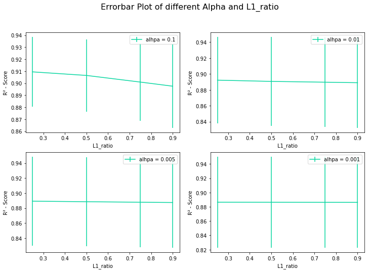
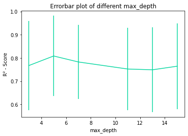
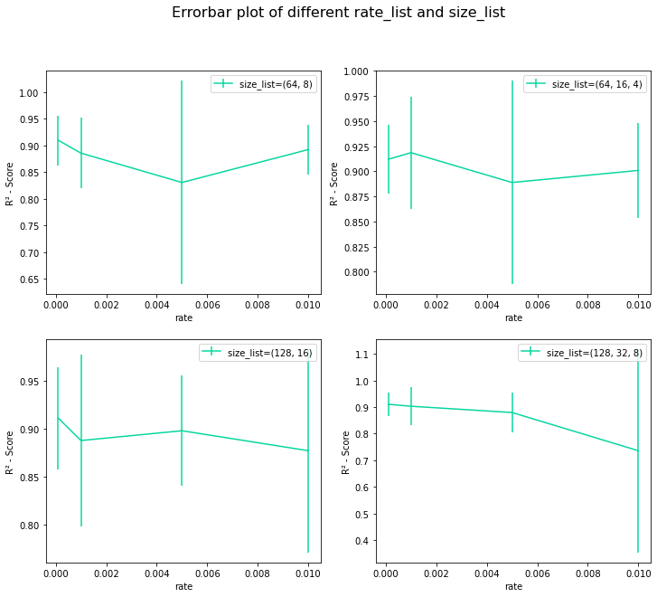

# Project Report: WIC Prediction

---

Group: 18

Member: YILUN LI, LONG PAN, QIGUANG WANG

---

### 1. Introduction

`WIC` is an American federal assistance program for health-care and nutrition, which aims to safeguard the health of low-income women, infants, and children up to age 5 who are at nutrition risk by providing nutritious foods to supplement diets, information on healthy eating, and referrals to health care. `WIC` made a difference for over 196,000 women, infants and children in Washington in 2021.

 The data about the Food Environment Atlas  are released by U.S. DEPARTMENT OF AGRICULTURE in the official DEPARTMENT OF AGRICULTURE website. The Atlas assembles statistics on three broad categories of food environment factors: **Food Choices**, **Health and Well-Being** and **Community Characteristics**. The Atlas currently includes more than 280 indicators of the food environment. The year and geographic level of the indicators vary to better accommodate data from a variety of sources. Some indicators are at the county level while others are at the State or regional level. The most recent county-level data are used whenever possible.

Based on the data and the number of participants in `WIC` over the years, we are trying to build some models to predict the number of participants in `WIC` in the future.

### 2. Dataset and Features

This file consists of 31481 lines of data and contains smultiple spreadsheets:
 - A variable list that includes metadata about all of the variables that are mapped in the Food Environment Atlas.
 - Spreadsheets that contain data for each of the Food Environment Atlas categories.
 - County- and State-level supplemental data that were used as the basis for a number of calculations in the Food Environment Atlas.

We acquire our data of the Food Environment Atlas from the open data website of U.S. Department of Agriculture. After basic detection of the dataset, we decided to delete the duplication lines in all spreadsheets. Considering that there are obvious correlations between some of the initially chosen features, such as the poverty rate of a city and the child poverty rate, we need to perform a correlation analysis for each group of variables that may be correlated, and then pick up some features that can be used for training the model. Here, the `Pearson` correlation coefficients between different features in each group are calculated to determine their linear correlations, thus achieving a preliminary correlation analysis as a part of feature selection. 

During data import phase, we normalize data by convert feature values from their original range into a standard range (0,1), while calculating the means and standard deviations of `cross_val_score`. To visualize its scores, we plot `heatmap` to display the result.

The initial feature groups are: 

- LACCESS_POP15, LACCESS_LOWI15, LACCESS_HHNV15, LACCESS_CHILD15, LACCESS_SENIORS15
- GROCPTH16, SUPERCPTH16, CONVSPTH16, SPECSPTH16, WICSPTH16
- FFRPTH16, FSRPTH16
- FOODINSEC_15_17, VLFOODSEC_15_17
- FMRKT_WIC18, FMRKT_WICCASH18
- POVRATE15, CHILDPOVRATE15

Here is the heatmap of correlation:

> 
>
> 
Figure 1: Heat map plot of different feature groups

Through the correlation results, it can be seen that there is a great correlation in the first group, so after discussion, we choose to leave `LACCESS_POP15` as a feature. There is a low correlation in the second group, so we can leave all features.

The feature 'State' in the data is a category variable, so it needs to be vectorized. Here Target Encoder is used to encode it. Target encoding is a method of vectorizing categorical variables based on label values. For categorical variable $X$, calculating the average $\overline{X_i}$ of labels corresponding possible value $X_i$, then replace all $X_i$ with $\overline{X_i}$. This encoding method can build relevance between categorical variable and label, which is helpful to following training process. Note that this kind of encoding requires a sufficient amount of data, or some categorical variable's value only has one corresponding label. This will cause severe over-fitting in encoding.

 In the end, we left a total of 13 variables. 

### 3. Methods

Our analysis contains three different learning algorithms, that includes `ElasticNet`, `Decision Tree` and `Multi-layer Perceptron Regressor`(MLPRegressor). We are explaining each of the algorithms subsequently:

#### 3.1 ElasticNet

We have learned `Ridge` regression and `Lasso `regression are two regression methods. They appear to solve the over-fitting of linear regression and the irreversibility of $(X^TX)$ in the process of solving $θ$ through the normal equation method. For the class of problems, both regressions achieve their goals by introducing a regularization term in the loss function. In order to prevent over-fitting ( $θ$ is too large), a complexity penalty factor, that is, a regular term, is added after the objective function $J(\theta)$ to prevent over-fitting.

The loss function of `ElasticNet` is:
$$
L(\bar{w})=\frac{1}{2 n}\|X \bar{w}-\bar{y}\|_{2}^{2}+\alpha \beta\|\bar{w}\|_{1}+\frac{\alpha(1-\beta)}{2}\|\bar{w}\|_{2}^{2}
$$
As can be seen from the above formula, two parameters $α$ and $β$ need to be provided when using `ElasticNet`. The name of the parameter in $β$ is **L1_ratio**. In the experimental part, these two parameters will be tuned using cross-validation.

#### 3.2 Decision Tree

`Decision Trees` (DTs) are a non-parametric supervised learning method used for classification and regression. The goal is to create a model that predicts the value of a target variable by learning simple decision rules inferred from the data features. A `decision tree` can be seen as a piecewise constant approximation. Here, we apply `DecisionTreeRegressor` of which the decision or the outcome variable is Continuous to our regression problem. The randomness of `DecisionTreeRegressor` is decided by using random_state as a seed for random selection of features. So we finalize it via cross validation estimator and set random_state to 23. In addition, we will use cross-validation to train the **max_depth** parameter of the decision tree in the experimental part.

#### 3.3 Multi-layer Perceptron Regressor

A neural network is a combination of lots of general process units. `MLP` is a type of artificial neural network (ANN). Its simplest form consists of at least three layers of nodes: an input layer, a hidden layer and an output layer. `MLP` is a feed-forward neural network where all neurons are arranged in an acyclic graph. We still evaluate the `l1_ratio` of `MLP` by cross-validation. In addition, we will use cross-validation to train the **hidden_layer_sizes** parameter and **learning_rate_init** of the decision tree in the experimental part.

### 4. Experiments/Results/Discussion

We use `cross-validation` to select **hyperparameters** for all models. The value of K for k-fold cross-validation should not be too small or too high, ideally we choose 5 to 10 depending on the data size.  Since our dataset is relatively small, we chose 5. 

#### 4.1 ElasticNet

The hyperparameter we tuned to our data for ElasticNet Regression were **alpha** and **L1_ratio**. **Alpha** determines how important the L1 penalty is.  The L1 penalty should encourage as many parameters as possible to be zero. We cross validated for **alpha** with the values 0.1, 0.01, 0.005 and 0.001. **L1_ratio** determines the ratio of the L1 penalty. The range selected here is: 0.25, 0.5, 0.75 and 0.9. By selecting the cross-validation with scoring as `r2`, the model results of various hyperparameters are solved, and the following figure is obtained, and then a set of parameters with the largest score is selected.

> 
>
> 
Figure 2: Errorbar Plot of different Alpha and L1_ratio

Among them, the parameter combination with the highest score is: **alpha = 0.1, l1_ratio = 0.25**, and the score is: **0.90941**.

#### 4.2 Decision Tree

The hyperparameter we tuned to our data for Decision Tree was `max_depth`. The model stops splitting when `max_depth` is reached. After repeated adjustments, it was decided to set the value of max_depth to:3, 5, 7, 11, 13 and 15.

In addition, regarding the `criterion` parameter, after adjustment, we found that the results of the changes between the parameters are not very large, so we still choose the default squared_error of the model.

By selecting the cross-validation with scoring as `r2`, the model results of various hyperparameters are solved, and the following figure is obtained, and then a set of parameters with the largest score is selected.

> 
>
> 
Figure 3: Errorbar Plot of different max_depth

It can be seen that with the increase of max_depth, the $R^2$ of the model tends to be stable, so the fitting result of the model is not bad. Among them, the parameter `max_depth` with the highest score is: 5, and the score is: **0.80846**.

#### 4.3 Multi-layer Perceptron Regressor

The hyperparameter we tuned to our data for `Multi-layer Perceptron Regressor` were `hidden_layer_sizes` and `learning_rate_init`.  The amount that the weights are updated during training is referred to as the step size or the `learning rate` . Specifically, the learning rate is a configurable hyperparameter used in the training of neural networks that has a small positive value, often in the range between 0.0 and 1.0.  The `hidden_layer_sizes` parameter allows us to set the number of layers and nodes we want to have in our neural network classifier. Each element in the tuple represents the node number at the $i$th position, where $i$ is the index of the tuple. Thus, the length of the tuple represents the total number of hidden layers in the network.

By selecting the cross-validation with scoring as `r2`, the model results of various hyperparameters are solved, and the following figure is obtained, and then a set of parameters with the largest score is selected.

> 
>
> 
Figure 4: Errorbar plot of different rate_list and size_list

It can be seen that with the increase of max_depth, the $R^2$ of the model tends to be stable, so the fitting result of the model is not bad. Among them, the parameter combination with the highest score is: **hidden_layer_sizes = 0.001, hidden_layer_sizes = (128, 16)** and the score is: **0.91845**.

#### 4.4 Comparison

We implemented a sklearn `Dummy` Regressor model that constantly predicted the mean of the target value from the training data. We can see that our baseline, the `dummy` regressor, performs worse than our tuned models. This indicates that our models were tuned successfully. 

Of our three models, `MLP`'s evaluation outperform `Elastic Net` and `Decision tree`. The R^2^ results for the training data are slightly better than the testing data. This is to be expected as the models are trained with this data whereas they have never seen the test data before.

> 
 Table 1: Comparison of different models

>
> |       | Train MAE | Test MAE | Train MSE | Test MSE | Train R² | Test R²   |
> | ----- | --------- | -------- | --------- | -------- | -------- | --------- |
> | EN    | 0.057     | 0.051    | 0.064     | 0.020    | 0.942    | 0.962     |
> | DTs   | 0.041     | 0.070    | 0.010     | 0.064    | 0.991    | 0.882     |
> | MLP   | 0.040     | 0.058    | 0.012     | 0.019    | 0.990    | 0.965     |
> | Dummy | 0.335     | 0.341    | 1.114     | 0.544    | 0.000    | -0.000173 |

### 5. Summary

In this report, we looked at training three models to predict the amount of candidates of WIC. We trained a `Elastic Net` model, `Decision tree` model and a `Multi-layer Perceptron Regressor` model along with a `dummy` regressor model we used for our baseline. Based on our results section, we are concluding that the `MLP` model was the best at predicting the amount. The `Elastic Net` model was better than `Decision tree`. All of our models were vast improvements on the dummy model. The features we selected impact heavily on the amount of candidates of WIC as can be seen from the predictions. 

### 6. Contributions

- Code Contributions
  - Analysis of Correlation (YILUN LI)
  - Data preprocessing (YILUN LI)
  - Baseline, Elastic Net, Decision tree, Multi-layer Perceptron Regressor(YILUN LI, LONG PAN)

- Report Contributions
  - Introduction  (LONG PAN)
  - Dataset and Features  (LONG PAN, QIGUANG WANG)
  - Methods – Christine (LONG PAN, QIGUANG WANG)
  - Experimentation/Results/Discussion – (LONG PAN)
  - Summary – (LONG PAN)

## 7. Appendix

Github: [Chenmo1212/ML-WIC_predict](https://github.com/Chenmo1212/ML-WIC_predict/)
