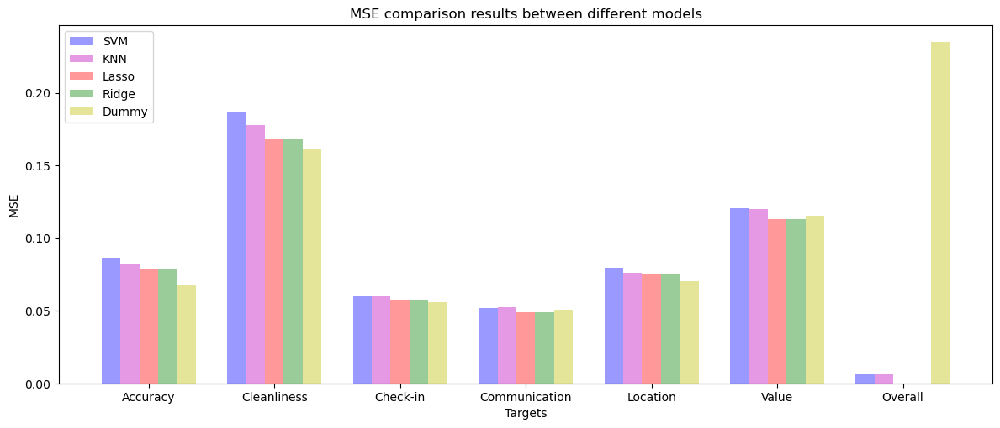

# Final Assignment

## Requirements

Based on the details of `Airbnb` listings and time-stamped reviews in Dublin, write a short report evaluating the feasibility of predicting for a listing the individual ratings for accuracy, cleanliness, check-in, communication, location and value and also the overall review rating.

## Cleaning and pre-processing

The data for Dublin AirBnB listings for September 2022 is downloaded in CSV format from the Inside AirBnB website (http://insideairbnb.com/get-the-data.html). The listing data has 75 feature columns and 7566 samples, and the raw review data have 243183 samples, where the listing_id in the review corresponds to the id in the listing data, so as to link the data of the two tables.

In listing data, there are features that describe host name and ID number, url's to the listings or photographs, and data scraping info, which were deemed of no use to the project and removed. In addition, a null value judgment is made for other features. When the values of existing features are all empty, the feature is deleted. So at this point the feature cannot be of any help to the project(The two features `bathrooms` and `neighborhood_group_cleansed` are deleted here). For features with a relatively high repetition rate between features, such as those related to `neighborhood`, `host_listings_count` and minimum and maximum night. By looking at the null value of each feature and combining the actual meaning, the feature with the largest degree is selected(left `neighborhood_cleansed`, `calculated_host_listings_count`, minimum and maximum night). All prices have a currency symbol followed by commas. For numerical analysis, these symbols need to be removed. In addition, the characteristics of the rate also contain "%", and these symbols need to be deleted, and the result is converted into a floating point type and divided by 100 to ensure that it is a decimal. In order to reduce the complexity, some new features are added to assist the numerical analysis of the current features, for example, an **`amentities_count`** is added to count the length of `amentities` in each sample. 

All in all, there are two main types of data, numeric and categorical. For numerical types, some useless characters will be removed, and regularization will be performed before training the model so that features of different orders of magnitude can also be maintained in the same dimension. For categorical data, the `LabelEncoder` library will be used to encode some categorical features and convert them into numeric types. Any features with True/False values are recoded as 1/0. 

In the comment file, not all comments are in English, and may contain non-text content, such as emoji, use the `langdetect` library to judge whether each comment is in English, and if not, use `googletrans` to translate it into English. For the translated content, useless symbols and data need to be cleared first, such as meaningless emoji and empty values, punctuation marks, and stop words. Then each comment is segmented and converted into a vector. Then calculate the average of these vectors, so that can get a value representing the comments in list_id. Finally, the obtained results are combined with the results after listing cleaning.

> 
>
> 
 Figure 1: Histogram of features with top ten null values

### Correlation analysis

The purpose of correlation analysis is to check whether there is a linear relationship between two variables and how strong their correlation is. It can help us better understand the relationship between variables in a dataset and how these variables can be used to predict other variables. The correlation analysis results are as follows:

> 
>
> 
 Figure 2: Heat map of correlation analysis

It can be seen in the figure that there is a relatively high linear correlation between some features. By observing the scope and actual meaning of each variable, it is decided to remove the following variables: '**property_type_category**', '**bathrooms_type**', '**reviews_per_month**', '**number_of_reviews_ltm**' , '**number_of_reviews_l30d**', '**bedrooms**', '**beds**', '**calculated_host_listings_count_entire_homes**', '**calculated_host_listings_count_private_rooms**',  '**calculated_host_listings_count_shared_rooms**'.

### Feature preparation

When training the model to predict, not all features are selected for prediction, because some features can be seen literally and have little relevance to the target to be predicted. Therefore, for different prediction targets, different training features should be set. Before substituted into the model analysis, the data will be normalized to ensure that the data are in the same dimension.

**Accuracy：**

> host_response_time，host_response_rate，host_acceptance_rate，host_is_superhost，host_has_profile_pic，host_identity_verified，neighbourhood_cleansed，room_type，accommodates，price，minimum_nights，maximum_nights，number_of_reviews，instant_bookable，calculated_host_listings_count，host_days_active，verification_count，amenities_count

**Cleanliness**:

> host_response_time，host_response_rate，host_acceptance_rate，host_is_superhost，host_has_profile_pic，host_identity_verified，room_type，accommodates，price，minimum_nights，maximum_nights，number_of_reviews，instant_bookable，calculated_host_listings_count，host_days_active，verification_count，property_type_category，bathrooms_type，amenities_count，neighbourhood_cleansed，review_mean

**check-in**：

> host_response_time，host_response_rate，host_acceptance_rate，host_is_superhost，host_has_profile_pic，host_identity_verified，neighbourhood_cleansed，room_type，accommodates，minimum_nights，maximum_nights，number_of_reviews，instant_bookable，calculated_host_listings_count，host_days_active，verification_count，property_type_category，bathrooms_type，amenities_count，review_mean

**communication**：

> 'host_response_time', 'host_response_rate', 'host_acceptance_rate', 'host_is_superhost', 'host_has_profile_pic', 'host_identity_verified', 'neighbourhood_cleansed', 'room_type', 'accommodates', 'price', 'minimum_nights', 'maximum_nights', 'number_of_reviews', 'instant_bookable', 'calculated_host_listings_count', 'host_days_active', 'verification_count', 'property_type_category', 'bathrooms_type', 'amenities_count', 'review_mean'

**location**：

> 'host_has_profile_pic', 'host_identity_verified', 'neighbourhood_cleansed', 'room_type', 'accommodates', 'price', 'number_of_reviews', 'instant_bookable', 'calculated_host_listings_count', 'host_days_active', 'verification_count', 'property_type_category', 'bathrooms_type', 'amenities_count', 'review_mean'

**value**：

> 'host_response_time', 'host_response_rate', 'host_acceptance_rate', 'host_is_superhost', 'host_has_profile_pic', 'host_identity_verified', 'neighbourhood_cleansed', 'room_type', 'accommodates', 'price', 'minimum_nights', 'maximum_nights', 'number_of_reviews', 'instant_bookable', 'calculated_host_listings_count', 'host_days_active', 'verification_count', 'property_type_category', 'bathrooms_type', 'amenities_count', 'review_mean'

**Overall**:

> 'review_scores_rating',  'review_scores_accuracy', 'review_scores_cleanliness',  'review_scores_checkin',  'review_scores_communication', 'review_scores_location', 'review_scores_value',

## Methods

Because this is a regression problem, I plan to use `Lasso`, `Ridge`, `Svm` and `Knn` to train the model, and use `Dummy` as the baseline to compare the fitting results with other models.

Each model, though different in specifics, underwent the same process of hyperparameter tuning and evaluation. The data were divided via an 80/20 train/test split. Hyperparameter tuning was conducted using a 5-fold cross-validation on the training data and by testing a model on the test data that has been trained on the entire training data. 

### Lasso

LASSO (minimum absolute contraction and selection operator) regression is a linear regression function with L1 penalty in the above cost function, which is highlighted in yellow. To avoid linear over fitting regression, the penalty term is added to the regularization function and promotes the sparsity of the solution, which means that 𝜃. If C is too small, all parameters will be zero. As C increases, as few parameters as possible will be non-zero. Therefore, these values will have all effects on the prediction. Therefore, LASSO regression learns which parameters have the most impact, and pays attention to these parameters when fitting the model.

### Ridge

Ridge regression is mainly used to analyze data with multicollinearity. Multicollinearity leads to unbiased least squares and large variance, which causes predicted values to be far from actual values. Ridge regression adds a penalty to the cost function of linear regression. It does this by performing L2 regularization. The hyperparameter C needs to be cross-validated by sweeping a range of values and comparing it to the mean squared error to get the best value of C.

### Svm

Support Vector Machines (SVM) is a supervised machine learning algorithm that can be used for classification or regression tasks. It is based on the concept of finding the hyperplane which best divides a dataset into two classes. SVM works by finding the optimal separating hyperplane, which is the plane that maximizes the margin between the two classes. The penalty term of SVM is a regularization term which is used to control the complexity of the model and to avoid overfitting. 

The penalty term is usually referred to as the "C" parameter in SVM. The C parameter determines the tradeoff between achieving a higher accuracy or reducing the complexity of the model. A higher value of C will result in a more complex model which tries to classify all training points correctly, while a lower value of C will result in a simpler model with a lower accuracy but higher generalization.

### Knn

The KNN algorithm is actually an instance-based learning method, which learns from the training data set without further model training. It can be used for both classification and regression problems. It classifies or predicts a value for a given point by calculating the distance from the given point to other points in the training set, and then selecting the K points closest to the distance. The penalty item of KNN is the nearest K points, and the hyperparameter is a distance measure used to measure the similarity between points, which can be Euclidean distance, Manhattan distance, Chebyshev distance, etc. In addition, KNN can also use different weight functions to determine that the closer the distance to a given point, the greater the weight. It can also use different kernel functions to handle different types of data to improve prediction accuracy. 

## Model Assessment

Since the four models have corresponding hyperparameters that need to be adjusted, a function is encapsulated in this project to pass in the corresponding model and the corresponding hyperparameter range to generate the MSE value corresponding to each hyperparameter. MSE is the abbreviation of Mean Squared Error, which is a measure of the error between the predicted value and the actual value. It represents the mean square error between the predicted value and the actual value. The smaller the MSE, the smaller the difference between the predicted value and the actual value, and the more accurate the prediction result, so the smaller the better.

In the SVM model, the selected hyperparameter is C, and the value range is: [0.001, 0.01, 0.1, 1, 10, 100]. The hyperparameter selected by KNN is n_neighbors, which specifies the number of nearest neighbors searched in the KNN algorithm , the range here is: [1, 5, 10, 15, 20, 25, 30, 50]. Both Lasso and Ridge hyperparameters are alpha. Alpha is the regularization coefficient, which is a parameter to adjust the complexity of the model, adjusts the strength of the regularization term in the model. The ranges here are: [0.000001, 0.00001, 0.0001, 0.001], [0.001, 0.01, 0.1, 1, 10, 100].

The figure below is the result of Accuracy training, from which the best hyperparameters for the corresponding model pair can be selected. 分别为：SVM: 100, KNN: 50, Lasso: 0.0001, Ridge: 10.

> 
>
> 
 Figure 3: Each model's hyperparameter adjustment graph for accuracy

In the same way, it is the same way to predict several other target values.

> 
 Table 1: Each model's MSE Results for Different Targets

>
> | MSE   | accuracy | cleanliness | check-in | communication | location | value  | overall |
> | ----- | -------- | ----------- | -------- | ------------- | -------- | ------ | ------- |
> | SVM   | 0.0860   | 0.1867      | 0.0602   | 0.0517        | 0.0796   | 0.1208 | 0.0065  |
> | KNN   | 0.0820   | 0.1775      | 0.0600   | 0.05213       | 0.07616  | 0.1198 | 0.0063  |
> | Lasso | 0.0786   | 0.1681      | 0.0571   | 0.0490        | 0.0750   | 0.1129 | 0.0000  |
> | Ridge | 0.0785   | 0.1681      | 0.0571   | 0.0490        | 0.0750   | 0.1128 | 0.0000  |
> | Dummy | 0.0676   | 0.1608      | 0.0556   | 0.0507        | 0.0702   | 0.1153 | 0.2348  |

> 
>
> 
 Figure 4: Each model's MSE results graph for different targets

It can be seen from the above results that there is not much difference between Lasso and Ridge, and there is not much difference between the four models in terms of Accuracy, cleanliness, check-in, communication, location, and value. In Overall, it can be seen that the fitting results of the four models far exceed the results of Dummy. And Lasso and Ridge are even better.

After the optimal hyperparameters are obtained, they are substituted into the model to obtain the coefficients of each part. There are some interesting phenomena. Among all the target attributes, `host_is_superhost` has the greatest weight. That is to say, if the landlord is certified as a superhost, the impact on the tenant is very high.

## Summary

The models used performed similarly, while they all performed better than the baseline regressor, none of the models described the data particularly well. Ridge and Lasso provided the best of all models in Overall target. 

We could not find many common features between the models, which indicates how measuring feature importance using metrics such as the feature coefficients can be misleading. Even though, some interesting features showed up like 'host_is_superhost'. Other more obvious features like 'host_verification' were also determinant across the cleanliness model.

# Part 2

## i

1. Logistic regression may give inaccurate predictions when the true relationship is non-linear. Logistic regression is a linear model that assumes that the relationship between the input features and the target variable is linear. If the true relationship is non-linear, logistic regression may not capture this relationship accurately and will give inaccurate predictions. 
2. When one class is much larger than the other, logistic regression can be sensitive to models that are biased towards predicting more classes. This can lead to inaccurate predictions for fewer classes.
3. If there are noise or outliers in the training data, logistic regression may be overly sensitive to these values and thus give inaccurate predictions. 
4. If the training data is insufficient, the logistic regression model may not be able to accurately learn the relationship between the input features and the target variable and will give inaccurate predictions. 
5. If there is multicollinearity (high correlation between multiple input features) in the training data, logistic regression may not estimate the coefficients accurately and give inaccurate predictions.

## ii

Both kNN (k-Nearest Neighbor) classifier and MLP (Multilayer Perceptron) neural network classifier are common classification models, and there are some advantages and disadvantages between them.

advantages:

- kNN classifier:
  - The kNN classifier is a simple and easy-to-use classification model. It does not require any training. It only needs to use the training data for comparison during prediction to get the result.
  - The kNN classifier can adapt to new data because it is recomputed at each prediction.
  - The kNN classifier can be applied to high-dimensional data because it does not require modeling of the data.
- MLP neural network classifier:
  - The MLP neural network classifier can handle complex nonlinear relationships because it can learn complex patterns through multiple hidden layers
  - The MLP neural network classifier can automatically adjust the weights during the training process, so as to obtain a higher accuracy rate.

disadvantages:

- kNN classifier:
  - The computational complexity of the kNN classifier is high because it needs to compare with all the training data at each prediction.
  -  The classification results of the kNN classifier may be affected by noise or outliers
- MLP neural network classifier:
  - The training time of the MLP neural network classifier is longer because it needs to tune a large number of parameters.
  - The MLP neural network classifier is difficult to explain because its decision-making process is implicit and not as easy to explain as a decision tree.
  - MLP neural network classifiers are prone to overfitting, especially when the training data is small.
  - The MLP neural network classifier is sensitive to the scale of the input data, so it needs to preprocess the input data to ensure that the input data has a similar scale.

## iii

k-fold cross-validation is a method for evaluating the generalization performance of machine learning models. In k-fold cross-validation, the dataset is resampled multiple times, and each sample is used to train and evaluate the model.

The reason for this is that oversampling allows us to more accurately assess the generalization performance of the model. Usually, we want the model to be able to accurately predict unseen data, that is, the performance of the model in the real world. However, if we only use one sampling to evaluate the model, it is likely to get an inaccurate result, because the noise and diversity of the data itself may have an impact on the model.

By resampling, we can more accurately evaluate the generalization performance of the model. In k-fold cross-validation, the dataset is divided into k mutually exclusive subsets of equal size and alternately sampled among these k subsets. Each sampling uses k-1 subsets for training and the remaining one for evaluation. The final result is the average of k evaluation results.

k=5 or k=10 is often considered a better choice, because this can eliminate large contingencies while ensuring a sufficient amount of data, thereby obtaining more accurate results. However, the selection of k is not fixed and can be adjusted according to specific situations. If the amount of data is small, a smaller value of k can be used; if the amount of data is larger, a larger value of k can be used.

Overall, k-fold cross-validation is a useful method for evaluating the generalization performance of machine learning models. By resampling, you can eliminate chance and get more accurate results.

## iv

Time series data refers to data arranged in time order. When dealing with time series data, it is often necessary to use time series features to help the model learn the relationship between time series.

Lagged output value is a commonly used time series feature, which refers to the output value at a certain point in time before the output value at the current time. Lagged output values can be used to capture relationships between time series, such as trends, periodicity, etc.

For example, suppose we have a time series data containing temperature values for each day. We want to use this data to predict future temperatures. We can use the lagged output value as a feature, taking the temperature value of the current day as input and the temperature value of the previous day as the lagged output value. This way, we can use lagged  output values as time series features which allow us to exploit the relationship between time series to help predict future values. For example, a large difference between the current day's temperature and the previous day's temperature may indicate a large temperature change in the future. Such information can help us make more accurate predictions.

In addition, using lagged output values can also help the model learn relationships such as trends and periodicities between time series. For example, if there are periodic fluctuations in the time series data, the lagged output values can be used to capture this periodic relationship and thus help the model to make more accurate predictions.